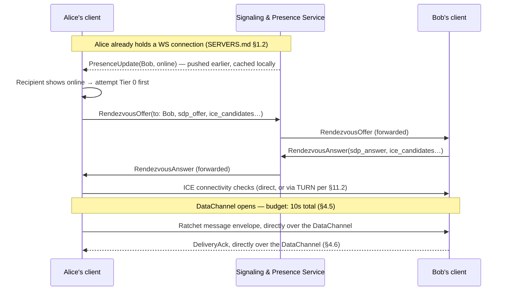
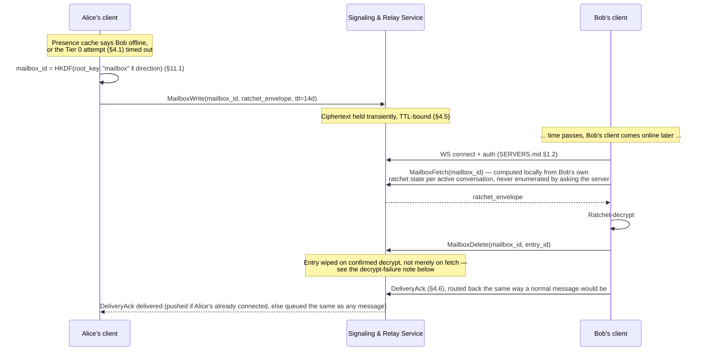
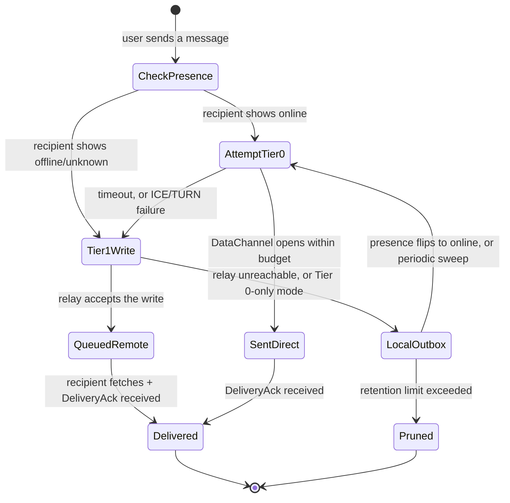

# DRAtchet — Architecture & Design

Status: **design draft, no code yet**
Target platforms: Windows, macOS, Linux (desktop)

See [`MESSAGE_SCHEMA.md`](MESSAGE_SCHEMA.md) for the concrete wire formats
referenced throughout (prekey bundle, ratchet message envelope, X3DH init,
pairing messages, presence protocol, recovery backup entry), and
[`SERVERS.md`](SERVERS.md) for the two optional server components (the
Signaling & Presence Service, and the Tier 2 Recovery Store) in full detail.

## 1. Recap: why "a fresh PGP keypair every message" doesn't work

The original idea was: encrypt every message with classic OpenPGP public-key
encryption, alternate which side's keypair is "active" every other message,
and throw away each private key the instant it's used.

That breaks under real messaging conditions:

- **Queue depth > 1.** If Alice sends two messages before Bob replies (common —
  offline recipient, slow reply, burst of messages), message #2 has no new
  public key to encrypt against, because in a strict alternating scheme the
  *next* key only exists once the recipient replies. The scheme is lock-step
  (ping-pong) and doesn't tolerate multiple in-flight messages, out-of-order
  delivery, or retries.
- **Cost.** Generating a new PGP keypair (especially RSA) and doing a full
  asymmetric encrypt/decrypt on *every single message* is orders of magnitude
  more expensive than symmetric crypto — noticeable latency and battery/CPU
  cost at chat volumes (this is exactly why nobody does this for real-time
  messaging).
- **Async delivery.** A store-and-forward server, multi-device, or a
  recipient who's offline for a while all need many messages to be encrypted
  and queued *before* any reply-driven key rotation could happen.

**This is a solved problem** — it's what the Signal Protocol's **Double
Ratchet** algorithm exists for. DRAtchet adopts Double Ratchet as the
key-rotation model, and uses OpenPGP where it actually earns its cost:
long-term identity, key discovery/verification, and signing — not as a
per-message asymmetric operation.

## 2. Design goals

1. Forward secrecy: compromise of a current key must not expose past messages.
2. Post-compromise (self-healing) security: after a compromise, the session
   heals itself once both sides exchange a couple more messages.
3. Tolerate real-world queueing: offline recipients, bursts, out-of-order
   delivery, retries — without breaking decryption or blocking on lock-step
   replies.
4. Every symmetric message key is single-use and is deleted immediately after
   one encrypt/decrypt.
5. OpenPGP is used for identity and key-agreement material (so keys are
   auditable, exportable, and interoperable with existing OpenPGP tooling),
   but never as a per-message bottleneck.
6. Native desktop app on Windows, macOS, Linux from one codebase.
7. Peer identity is authenticated out-of-band (in-person QR, or a remote
   single-use pairing code) rather than trusted on lookup alone.
8. Message history is unrecoverable by default; recovery is only ever an
   explicit, mutual, per-conversation opt-in.

## 3. Cryptographic protocol

### 3.1 Identity keys (OpenPGP)

Each user has one long-term OpenPGP identity keypair (Ed25519 signing +
Curve25519 ECDH, OpenPGP v6 per RFC 9580, following the modern GnuPG default
profile). This is the key a user backs up, the key behind their fingerprint,
and the key used to sign everything below. It is **never** used to encrypt
message content directly.

### 3.2 Session establishment — X3DH over OpenPGP subkeys

Modeled on Signal's X3DH, but the key material is carried as OpenPGP packets:

- Each user publishes a **prekey bundle** to the relay server:
  - Identity key (long-term).
  - One **signed prekey** (ECDH Curve25519 subkey), signed by the identity
    key, rotated periodically (e.g. weekly).
  - A batch of **one-time prekeys** (ECDH Curve25519 subkeys), uploaded in
    bulk; the server hands out one per new session and then deletes it.
- To start a session, the initiator fetches the recipient's bundle, verifies
  the signed prekey's signature, and performs the X3DH DH computations
  (IK_A×SPK_B, EK_A×IK_B, EK_A×SPK_B, EK_A×OPK_B) to derive a shared secret
  via HKDF. This becomes the Double Ratchet **root key**.
- The consumed one-time prekey is deleted server-side immediately and
  client-side once the session is confirmed — this is the genuinely
  single-use, discard-after-use keypair in the system.

### 3.3 Message layer — Double Ratchet

Once the root key exists, per-message crypto is entirely symmetric:

- **Symmetric-key ratchet:** every message advances a one-way HMAC chain
  (`KDF_CK`) to derive a per-message key. That message key encrypts exactly
  one message (AEAD: ChaCha20-Poly1305 or AES-256-GCM) and is deleted right
  after use — this is where "single-use key, discarded after one message" is
  fully and cheaply true.
- **DH ratchet:** each message header carries the sender's *current* ratchet
  public key (an OpenPGP-compatible Curve25519 ECDH key) — this is the
  "follow-on message includes the latest public key for the next
  transmission" behavior from the original brief. A *new* DH keypair is
  generated, and the ratchet steps forward (new root + chain keys), the first
  time a side replies after receiving — i.e., key rotation is driven by
  turn-taking, not by a literal count of messages. The old ratchet private
  key is discarded the moment the new one replaces it.
- **Skipped-message key cache:** because the chain KDF is a one-way function,
  keys can be derived ahead and cached (bounded, e.g. `MAX_SKIP = 1000`) for
  messages that arrive out of order or after a backlog. **This is the direct
  answer to the queue-depth question**: Double Ratchet was built to tolerate
  exactly the burst/offline/out-of-order conditions that break a strict
  alternating-PGP-keypair scheme.

### 3.4 Key lifecycle summary

| Key | Lifetime | Discarded when |
|---|---|---|
| Identity keypair | Long-term (years) | User rotates/revokes identity |
| Signed prekey | Days–weeks | Replaced on rotation schedule |
| One-time prekey | Single session handshake | Immediately after session establishment |
| DH ratchet keypair | Until the peer's next reply | Replaced by next DH ratchet step |
| Per-message symmetric key | Single message | Immediately after that message is encrypted/decrypted |
| Remote pairing code (§6.4) | Single verification attempt, ~10 min TTL | On first successful match, or expiry — whichever first |
| Conversation recovery key (§7, only while the *effective* policy is A or B) | Life of the conversation's effective recovery policy | Automatically, the moment the effective policy reaches Profile C (§7.2/7.3) — individual stored entries are also auto-purged at that point, not just the key |

### 3.5 Message wire format: full OpenPGP vs. lightweight custom envelope

Two different things can be "OpenPGP" here, and it's worth separating them:
**key material** (identity keys, prekeys — already specified as OpenPGP
packets in §3.1/3.2) vs. **message bodies** (the ciphertext for an individual
chat message). This section is only about the latter.

**Full OpenPGP wire format** means every message is itself a valid OpenPGP
message: a Public-Key Encrypted Session Key (PKESK) packet (or, to actually
carry a ratchet-derived key, a repurposed Symmetric-Key Encrypted Session Key
/ SKESK packet) followed by a Symmetrically Encrypted Integrity Protected
Data (SEIPD) packet per RFC 9580 — the same packet structure as a `.pgp`
file GnuPG produces.

**Lightweight custom envelope** means a minimal, application-defined
structure: a fixed ratchet header (sender's current DH public key, message
number `N`, previous chain length `PN`) followed by an AEAD ciphertext +
tag. Nothing about it is OpenPGP-packet-shaped; only the *keys* (§3.1/3.2)
are OpenPGP objects.

| | Full OpenPGP wire format | Lightweight custom envelope |
|---|---|---|
| **Per-message overhead** | Multiple packet headers + MPI-encoded fields — noticeably larger than the payload for short chat messages | Fixed ~40–50 byte header (32-byte pubkey + two counters) + ciphertext + 16-byte tag — minimal |
| **Where ratchet metadata lives** | No natural home — the DH pubkey/counters would have to be smuggled into Notation Data subpackets or a custom packet type, which itself breaks strict standard-compliance | First-class fields in a header designed exactly for what Double Ratchet needs |
| **Real interoperability** | Looks standard, but a generic OpenPGP/GnuPG client still can't decrypt it — the "session key" is ratchet-derived, not produced by a normal public-key encryption step, so the compatibility is mostly cosmetic | None claimed — doesn't pretend to be readable by outside tools |
| **Parsing surface / attack surface** | Larger — full packet parser, MPI decoding, subpacket handling per message | Small, fully controlled, easy to fuzz/test exhaustively |
| **Engineering cost** | Reuses a standardized format for *framing*, but key derivation is custom either way — you inherit format complexity without shedding protocol-design responsibility | Faster to implement correctly; entire format fits in a page |
| **Future flexibility** | If a hard requirement later appears to bridge to PGP/MIME email or produce gpg-decryptable archives, this gets partway there | Would need a translation layer built later if that requirement ever appears |
| **Tooling** | Can reuse existing OpenPGP packet inspectors for debugging | Debug/inspection tooling must be custom-built (small effort given the format's size) |

**Recommendation (decided, revisit only if a concrete interop requirement
appears):** OpenPGP packet format for identity keys and prekey bundles
(§3.1/3.2), lightweight custom envelope for message bodies. The claimed
interoperability benefit of full OpenPGP message framing is largely
illusory — a stock OpenPGP client still can't decrypt a ratchet-derived
session key — so it doesn't justify the extra size, parsing surface, and
awkward header-metadata fit. Message bodies never leave the app anyway
(they're deleted from the ratchet the instant they're used, per §3.4), so
there's no real-world scenario where a generic PGP tool needs to read one.

There's a second reason to prefer AEAD over an OpenPGP-signed message that
has nothing to do with size: **deniability**. See §11.6.

## 4. System architecture: a serverless-first, tiered model

The earlier draft assumed a single always-present relay server doing three
jobs at once: routing/discovery, offline store-and-forward, and (implicitly)
being the thing a recovery backup would sit on. Splitting those three jobs
apart is what makes "serverless" and "recoverable" both possible — they turn
out to be independent decisions, not one all-or-nothing server. Message
schemas referenced below are in
[`MESSAGE_SCHEMA.md`](MESSAGE_SCHEMA.md).

### 4.1 Tier 0 — pure peer-to-peer (strictest serverless)

- Clients connect directly over a **WebRTC DataChannel** (available in all
  three target webviews — WebView2, WKWebView, WebKitGTK — no native
  networking code needed, consistent with the "one core, thin OS glue"
  approach in §5).
- WebRTC still needs a **rendezvous step** before a direct connection
  exists: exchanging ICE candidates/SDP, and NAT traversal (STUN always,
  TURN as a relay-of-last-resort behind symmetric NATs). None of this
  carries message content — only connection-setup metadata and prekey
  bundles (§1 of `MESSAGE_SCHEMA.md`), both already meant to be public.
  A minimal, stateless signaling service can host this (or a DHT — see §4.4
  open question); either way it holds no ciphertext, ever.
- **Delivery requires both peers online at overlapping times.** If the
  recipient isn't reachable, the message queues **locally on the sender's
  device** and retries on the next connection attempt. This is the honest
  cost of Tier 0, and it's the same queue-depth question from the very
  first design pass, resurfacing at the transport layer instead of the
  crypto layer: the Double Ratchet's skipped-message-key cache (§3.3) still
  handles out-of-order/backlogged *decryption* just fine once messages
  arrive — Tier 0's limitation is purely "when can delivery happen at all,"
  not "can the crypto keep up."
- **Zero recovery, by construction** — there is no third party anywhere in
  this path holding ciphertext, so there's nothing to recover from if a
  device is lost. This is the mode the task description means by "even if
  that means foregoing the possibility of recovering messages."
- **Trade-off worth naming plainly: direct P2P reveals IP addresses between
  the two people talking**, unlike a centrally-routed service (Signal,
  WhatsApp) where users never learn each other's IP. This is the flip side
  of removing the server from the path — see §11.2 for the mitigation
  (a user-facing toggle to force relaying even when direct is possible).

**Concrete connection flow:**



Once the DataChannel is open, WebRTC's SCTP-based data channel already
gives reliable, ordered delivery for as long as both sides stay connected —
no relay, no TTL, no delivery token needed for this path. The signaling
service's only role was the rendezvous handshake at the top; it's out of
the loop for the rest of the conversation until the next rendezvous is
needed (e.g. after a network change forces reconnection).

### 4.2 Tier 1 — ephemeral relay-assisted (pragmatic default)

Same as Tier 0, plus one addition: an optional **ephemeral store-and-forward
hop** to bridge the gap when both peers aren't online at the same time,
without becoming a durable archive.

- Implementable as genuinely serverless-hosted infrastructure (e.g.
  Cloudflare Durable Objects/KV, or an equivalent self-hostable minimal
  relay) — no long-running process to patch or operate, but it is still
  third-party infrastructure in the delivery path, unlike Tier 0.
- Holds ciphertext **transiently**: short TTL (days, not months) and/or
  auto-wipe on delivery acknowledgment — a mailbox, not an archive. The
  relay envelope wraps the opaque ratchet message envelope with only
  routing metadata: a `mailbox_id`, a TTL, and a delivery token. `mailbox_id`
  is **not** a static per-device inbox — it's derived per conversation
  *direction* from ratchet state (`HKDF(root_key, "mailbox" ‖ direction)`,
  rotating in step with the DH ratchet) — see §11.1 for why: a static
  per-device id would let the relay trivially see "how many distinct
  contacts write to this device," which a derived, unguessable-without-the-
  handshake id avoids. This wrapper is a thin, tier-specific addition on
  top of the ratchet message envelope defined in §2 of `MESSAGE_SCHEMA.md`,
  which stays identical across all tiers — the relay never needs to
  understand it, only pass it along.
- This is the recommended **default** for v1: pure Tier 0 is more
  privacy-strict but has a materially worse offline-delivery experience for
  an MVP; Tier 1's relay never sees plaintext or ratchet state and holds
  ciphertext only transiently, so it stays close to Tier 0's guarantees
  while being usable when both people aren't online together.
- Still **zero durable recovery by default** — a Tier 1 relay auto-wiping
  ciphertext after delivery is not a backup, even though it technically
  "stores" something briefly. That distinction should be explicit in any
  user-facing description of Tier 1, so it doesn't get conflated with §4.3.

**Concrete mailbox flow:**



- **Delete-on-decrypt, not delete-on-fetch:** the recipient's client only
  issues `MailboxDelete` after the fetched envelope decrypts successfully.
  If decryption fails (corrupted transit, a bug, or an out-of-window replay)
  the entry is left in place for one retry rather than being silently lost
  on a fetch that didn't actually succeed end-to-end.
- **Pull on reconnect, push if already connected:** a client always issues
  `MailboxFetch` for its active conversations' current `mailbox_id`s right
  after establishing its WebSocket connection (covers "was offline, came
  back"). If the recipient is *already* connected when a write lands, the
  service can additionally push it immediately over the open WebSocket —
  push-if-connected is a latency optimization, not a substitute for the
  pull-on-reconnect path, which is what actually guarantees delivery.
- See §4.5 for the exact retry/backoff parameters and §4.6 for how
  `DeliveryAck` prunes the sender's local outbox.

### 4.3 Tier 2 — opt-in recovery layer (graded profiles, self-hostable)

Layers on top of *either* Tier 0 or Tier 1 — orthogonal to which delivery
tier is in use. This is exactly the §7 recovery design, restated with the
hosting question now answered: the durable, decryptable-with-the-recovery-
key backup store doesn't need to be a DRAtchet-operated service at all, and
— now specified in full in [`SERVERS.md`](SERVERS.md) §2 — it doesn't need
to be *shared* between the two participants either. Each side configures
their **own** recovery destination (their own self-hosted server or cloud
bucket); what actually gets written there is governed by the conversation's
*effective* policy — the more restrictive of the two sides' Profile A/B/C
choices (§7.2) — but the storage itself stays single-owner, which keeps
blast radius, deletion semantics, and auth all simpler than a shared store
would — see `SERVERS.md` §2 for the full reasoning and API.

Tier 2's activation is a conversation-level outcome computed from both
sides' recovery profiles (§7), not a manual accept step — it never happens
as a side effect of picking a delivery tier, and picking Tier 0 for
delivery doesn't preclude Tier 2 for recovery or vice versa.

### 4.4 Cross-cutting notes

- Large backlog handling is unchanged from the original design regardless
  of tier: the skipped-key cache is bounded (`MAX_SKIP`); if a recipient is
  unreachable long enough to exceed it, the client falls back to a fresh
  X3DH session establishment rather than growing the cache unbounded. Tier 0
  additionally needs a local outbox retention/pruning policy on the
  *sender* side, since undelivered messages accumulate there instead of on
  a server.
- Prekey bundle discovery (`username#NNNN` → bundle, §6.1) needs *some*
  discoverable location even in Tier 0/1 — recommend the same minimal
  signaling service also serves this (public-key material only, low
  sensitivity, much simpler than a full DHT) rather than standing up a
  second piece of infrastructure. Flagged as an open decision in §10 if a
  fully decentralized (DHT-based) directory turns out to matter more than
  the simplicity of a small serverless KV store.
- **Online-status/presence** is a fourth job that same signaling service
  can hold: whether a contact is currently reachable, used both for UX (a
  presence indicator) and to decide whether to attempt Tier 0 direct
  delivery or go straight to a Tier 1 mailbox/local outbox. Full design —
  connection/auth model, presence visibility rules, and why it stays
  ephemeral (in-memory, not logged) rather than becoming another durable
  store — is in [`SERVERS.md`](SERVERS.md) §1.
- Multi-device and group chat remain **out of scope for v1** (Roadmap, §9)
  — both interact with the tiering question (a DHT or relay mailbox model
  changes shape once "recipient" means multiple devices) and are better
  tackled once the 1:1 ratchet and delivery tiers are solid.

### 4.5 Tier selection & fallback state machine

Per outgoing message, not per conversation — presence can change between
one message and the next, so the tier decision is re-made each time rather
than pinned for the conversation's lifetime.



Concrete parameters (v1 defaults — all client-side/tunable, nothing here
requires relay-side coordination beyond the TTL):

| Parameter | Default | Rationale |
|---|---|---|
| Tier 0 connection attempt budget | 10s total | STUN-only paths typically resolve in under 2s; TURN fallback adds a few more — 10s covers the realistic worst case without stalling the send indefinitely |
| ICE gathering sub-budget | 5s | Within the 10s total |
| Tier 1 mailbox TTL | 14 days | Long enough for a genuinely offline recipient (device off, vacation), short enough to keep "mailbox, not archive" true — see §12 for how a server-based deployment might reasonably extend this |
| Tier 1 write retry backoff | 1s → 60s exponential, capped | For a transiently unreachable relay, not a permanently down one |
| Local outbox retention | 500 messages/conversation **or** 30 days, whichever hits first | Oldest-pruned-first; pruning surfaces a visible "couldn't be delivered" notice rather than failing silently |
| Retry trigger for a stalled outbox | Event-driven on a presence transition to online, plus a 5-minute periodic sweep while foregrounded | Avoids polling the relay/peer on a tight loop while still self-healing if a presence event was missed |

### 4.6 Delivery acknowledgment

A message being *sent* isn't the same as it being *delivered* — the sender
needs to know when to stop retrying (§4.5's `LocalOutbox`/`QueuedRemote`
states) and the UI needs something to base a delivery indicator on. A new
schema message, `DeliveryAck` (§7 of `MESSAGE_SCHEMA.md`), closes this loop:

- Sent by the recipient's client the moment a ratchet envelope **decrypts
  successfully** — not on mere receipt, so a corrupted-in-transit message
  never gets falsely acked.
- Routed back exactly like a normal message would be: over an open Tier 0
  DataChannel if one exists, otherwise written to a Tier 1 mailbox the same
  way — `DeliveryAck` gets no special-cased transport.
- On receipt, the sender prunes the corresponding entry from its local
  outbox/retry queue (§4.5) and the UI can show a delivered indicator.
- **This is deliberately *delivery*, not *read*.** Whether the human on the
  other end has actually looked at the message is a separate, more
  privacy-sensitive signal (Signal, WhatsApp, and iMessage all draw exactly
  this line, and all let users turn read receipts off independently of
  delivery confirmation). DRAtchet's v1 scope is delivery acknowledgment
  only; a `ReadReceipt` message would follow the identical pattern but
  should default to **off**, user-toggleable per conversation, tracked as
  an open decision in §10 rather than shipped as an unconditional default.

## 5. Client / platform architecture

**Decided:** one stack, one codebase, for all three target platforms —
**Tauri (Rust core) + web-based UI**, shipping natively on Windows, macOS,
and Linux. No per-OS fork and no separate Electron track; platform
differences are handled as integration details within the single core, not
as different stacks.

- Rust core handles all cryptography and ratchet state — no crypto in the UI
  layer. Candidate crates: `sequoia-openpgp` (OpenPGP identity/prekeys),
  `x25519-dalek` (ECDH), `hkdf` + `hmac` + `sha2` (ratchet KDFs),
  `chacha20poly1305` (AEAD). All are audited, widely used RustCrypto/Sequoia
  ecosystem crates rather than hand-rolled primitives.
  - Rust over Electron/Node for this project specifically because the crypto
    core benefits from memory safety and a mature native OpenPGP
    implementation (Sequoia); Tauri's footprint and update size are also
    substantially smaller than Electron's.
- Local storage: SQLite (SQLCipher-encrypted) for session/ratchet state, with
  the local database encryption key sealed via the OS credential store —
  Windows DPAPI, macOS Keychain, Linux Secret Service (libsecret) — not a
  user password alone.
- IPC between the web UI and Rust core stays within Tauri's command bridge;
  the UI never handles raw key material, only decrypted message text and
  metadata.
- **Per-platform integration points** (same core logic, different OS glue):
  - *Windows*: DPAPI-backed secret storage; camera access for QR scanning
    (§6) via the WebView2 webview's `getUserMedia`.
  - *macOS*: Keychain Services-backed secret storage; camera access via
    WKWebView's `getUserMedia` (requires the standard camera-usage
    entitlement/Info.plist string).
  - *Linux*: Secret Service API (libsecret) for secret storage; camera
    access via WebKitGTK's `getUserMedia`. Caveat: not every Linux desktop
    environment runs a Secret Service provider by default (minimal window
    managers, some headless/remote setups) — the client needs a graceful
    fallback (e.g., a local passphrase-derived key-encryption-key) rather
    than failing to start when libsecret is unavailable.
  - QR display/scanning itself needs no native camera code on any platform
    — a webview `getUserMedia` call plus in-app QR encode/decode (pure
    Rust or JS library) covers all three.

## 6. Identity addressing & peer authentication

### 6.1 Addressing: `username#NNNN`

Each account has a self-chosen **username** plus a server-assigned random
**4-digit discriminator**, e.g. `alice#4821` — regenerated on collision
within that username (Discord's original scheme). The directory server maps
`username#NNNN` → account ID → current prekey bundle (§3.2). This address is
how you *locate* someone's prekey bundle; it is **not** proof of who
controls it — the server could in principle be compromised or coerced into
serving a substituted bundle, which is exactly what §6.2 defends against.
(Namespace note: a 4-digit discriminator caps a single username at 10,000
accounts before it runs out — fine at the scale this project is targeting;
flagged in §9 as revisitable if that ever becomes a real constraint.)

### 6.2 Trust levels

Every contact is either:

- **Unverified** (default, TOFU — trust-on-first-use): the client has a
  prekey bundle for `username#NNNN` fetched from the directory server, but
  its fingerprint hasn't been independently confirmed. The UI should flag
  this clearly (a persistent banner in the conversation, similar to Signal's
  unverified-safety-number indicator) without blocking sending — flagging
  risk beats blocking usability.
- **Verified**: the identity key's fingerprint has been confirmed through
  one of the two paths below, and is pinned locally. If the peer's identity
  key later changes, the contact reverts to "unverified — identity changed"
  and must be re-verified, the same way Signal treats a safety-number change.

### 6.3 Path 1 — in-person QR exchange (strongest)

Each device can render a QR code encoding `username#NNNN` + the SHA-256
fingerprint of its current identity key (+ a short random nonce so a stale
photographed code is visibly different from a fresh one). Both people scan
each other's codes in the same physical session; each client compares the
scanned fingerprint against the bundle it already has (or fetches fresh) for
that address — match marks the contact **Verified**; mismatch is a hard
stop, never silently marked verified. Because the fingerprint came straight
from a physically-present device, this path doesn't need to trust the
directory server at all — it's the strongest of the two.

### 6.4 Path 2 — remote pairing via username + single-use code

For contacts who aren't in the same room:

1. Initiator looks up `username#NNNN` on the directory server and fetches
   the prekey bundle — this alone is TOFU, no stronger than any first
   contact today.
2. The recipient's app generates a random, single-use, short-TTL numeric
   pairing code (e.g. 6 digits, ~10-minute expiry; generating a new one
   invalidates the previous code).
3. The recipient reads that code to the initiator over a channel they
   already trust more than the directory server (phone call, an existing
   verified DRAtchet conversation, in person, etc.) — the code is the "MFA"
   factor here: proof that the person on the other end of that channel
   currently controls the account, demonstrated by generating and reading
   it out.
4. The initiator enters the code in-app. The client sends it back bound to
   the current handshake's key material (so it can't be replayed against a
   different session); the recipient's device checks the match, and both
   sides are marked **Verified**.
5. The code is consumed (deleted) on first successful match or on expiry,
   whichever comes first; a fresh code is required for another attempt, and
   attempts are rate-limited — a 6-digit space is brute-forceable without
   that limit.

Be precise about what this does and doesn't prove: it authenticates that
whoever generated the code controls the account being paired with, and its
security rests entirely on the secrecy/integrity of whatever side channel
carried the code — the same property Signal's "compare safety number over a
phone call" verification has. It is not stronger than the channel used to
convey the code.

## 7. Per-conversation message recovery

**Default: unrecoverable.** Pure Double Ratchet behavior from §3.3 — every
message key is deleted immediately after one use, nothing is escrowed or
backed up anywhere. Losing a device loses that conversation's history from
that point on; this is forward secrecy working as intended, not a missing
feature.

### 7.1 Three recovery profiles, not a binary switch

Each account sets its own **Recovery Profile**, ranked here from most to
least data retained:

| Profile | What gets stored (in *that user's own* store, §2.1 of `SERVERS.md`) | Restrictiveness |
|---|---|---|
| **A — Full** | Everything that user's client has plaintext for: messages they sent *and* received | Least restrictive |
| **B — Sent-only** | Only messages that user authored — nothing they received from the other party | Middle |
| **C — None** | Nothing. Full wipe: no recovery for this conversation, by either side | Most restrictive |

Profile B exists for a real, distinct reason from "off": a user may be
comfortable being the custodian of a durable copy of *their own* words but
not want to hold a durable copy of what someone else sent them — courtesy,
deniability-adjacent, or a support/professional context where retaining a
counterpart's content carries its own liability. It's a genuinely different
point on the spectrum, not a watered-down version of A.

### 7.2 Effective policy: most restrictive wins

The two participants' profiles are not independent settings that each
quietly do their own thing — they compose into one **effective policy for
that conversation**, and composition always favors the more restrictive
side:

```
effective(conversation) = min(profile(A-side), profile(B-side))
      ordering: C (0, most restrictive) < B (1) < A (2, least restrictive)
```

Worked example (the one in the requirement): Alice sets Profile B (store
what I send). Bob sets Profile C (store nothing). `min(B, C) = C`. The
effective policy is **C for the conversation** — Alice does **not** get to
keep her own sent messages either, because Bob's more restrictive choice
governs the whole conversation, not just Bob's own store. A party can
always unilaterally make a conversation *more* restrictive by choosing C or
B; no one can unilaterally make it *less* restrictive than their
counterpart allows.

This replaces the earlier binary "propose, then both sides explicitly
accept" flow with something simpler and deadlock-free: there's no proposal
to leave hanging. Each side continuously publishes its own current profile
(§7.3); the effective policy is a pure, deterministic function of both,
recomputed live. Silence/unknown fails closed to **C**, never to A or B —
an account whose counterpart hasn't announced a profile yet (e.g., an
old client, or the announcement hasn't arrived) is treated as if that
counterpart chose C, so ambiguity can never accidentally produce more
storage than intended.

**UX requirement, not just a protocol note:** if a user's own profile is
more permissive than the conversation's effective policy, the client must
say so plainly ("You've set Full Recovery, but this conversation is
storing nothing because your contact has chosen not to recover messages")
— otherwise a user could reasonably believe they have a backup they don't.

### 7.3 Mechanism

Deliberately layered *on top of* the ratchet rather than changing it, same
as before:

- The normal ratchet encrypt/decrypt path (§3.3) is untouched — per-message
  keys are still single-use and discarded exactly as in the default case.
- Each account announces its current profile via `RecoveryProfileAnnounce`
  (§8 of `MESSAGE_SCHEMA.md`) — sent at session establishment, and again
  whenever the local profile changes (a global default, with an optional
  per-conversation override — the announcement carries whichever is
  currently active for that conversation). Like `DeliveryAck` (§4.6), this
  travels as an ordinary ratchet payload — authenticated between the two
  parties, invisible to any relay.
- The moment the effective policy is anything other than C for a
  conversation for the first time, a **conversation recovery key** is
  derived via HKDF over fresh randomness contributed by *both* sides plus
  the current root key — same derivation as before, just triggered by the
  computed effective policy rather than an explicit accept step.
- **Write-time filtering, driven by the effective policy, not the local
  profile alone:** after the normal send/receive path completes, a client
  encrypts the plaintext under the conversation recovery key and uploads it
  to its own store — but only if the effective policy allows storing *that
  particular message*. Under effective A, both sent and received messages
  are written. Under effective B, only messages that account authored are
  written (the `written_by` field already in `RecoveryBackupEntry`, §5 of
  `MESSAGE_SCHEMA.md`, is what a client checks against its own identity to
  decide). Under effective C, nothing is written, ever.
- **Tightening purges retroactively — this supersedes the earlier
  "revoke doesn't delete automatically" note.** With three graded levels
  instead of a binary switch, leaving already-stored entries in place after
  the effective policy tightens would mean a store silently holds more than
  the current mutual agreement covers, undermining the reason profiles
  compose at all. So: the moment the effective policy for a conversation
  becomes more restrictive (A→B, B→C, or A→C), each client purges whatever
  it's holding that the new effective policy no longer permits —
  `written_by = peer` entries on an A→B tightening, everything on a
  transition to C. The Recovery Store API supports this directly (§2.2 of
  `SERVERS.md`, filtered delete). The UI surfaces this as a visible
  notice ("N previously backed-up messages were deleted because your
  contact updated their recovery setting"), not a silent background
  cleanup — a purge is exactly the kind of action that needs to stay
  legible to the user even though it doesn't need their confirmation to
  proceed (the whole point is that a counterpart's more restrictive choice
  doesn't require anyone's permission to take effect).
- **Loosening never retroactively creates history.** Going B→A doesn't
  reconstruct previously-skipped received messages — filtering is a
  write-time decision, not stored-then-hidden, so there's nothing to
  reveal. Only genuinely new writes going forward benefit from a loosened
  policy.
- **The conversation recovery key itself** is discarded when the effective
  policy reaches C (nothing left for it to protect), but persists across an
  A↔B tightening/loosening — only *which* entries get written changes,
  not the key underneath them.
- The conversation recovery key must itself survive a lost device to be
  useful, which means it needs to be escrowed somewhere (only relevant once
  the effective policy is A or B for at least one side). Two options,
  covered in §10 as an open decision:
  a. **Self-custodied recovery phrase** (BIP39-style words), shown once,
     stored by the user — the server never holds anything decryptable.
     Strongest privacy, worst UX (permanently lost if the user loses it).
  b. **Server-escrowed, passphrase-protected** blob (Argon2id-derived key,
     Signal-SVR/WhatsApp-backup-key style) — better UX, but needs a
     rate-limited, tamper-resistant attempt counter (typically an HSM/secure
     enclave) to resist offline brute force against the escrowed blob —
     nontrivial infra.
  - Recommendation for v1: (a), self-custodied — no secure-enclave
    infrastructure required to ship; revisit (b) later if user demand for
    better recovery UX justifies building that infra.

### 7.4 The honest limit of any of this

Worth stating plainly, not just implying: **profiles are enforced by
honest-client conformance, not cryptography.** Every message already
reaches the recipient's client as plaintext, by construction of end-to-end
messaging — nothing stops a modified or malicious client from retaining
everything regardless of the announced or effective profile, the same way
nothing stops a screenshot. `RecoveryProfileAnnounce` and the effective-
policy computation are a real, meaningful commitment between two honest
clients — not a technical guarantee against a party who chooses not to
honor it. This is the same category of limit the original recoverable-mode
threat-model note (§8) already flags; the three-profile system doesn't
change the category, just gives honest clients a more precise agreement to
honor.

## 8. Threat model

In scope:
- Passive network eavesdropping.
- A compromised or malicious Tier 1 relay, or a compromised signaling/
  directory service (§4) — neither ever sees plaintext, ratchet state, or
  long-term key material; the relay's ciphertext access is also
  time-bounded by its TTL (§4.2), not indefinite, and its ability to link
  mailbox writes to a specific device is reduced (not eliminated — see
  §11.1) by deriving `mailbox_id` from ratchet state instead of using a
  static per-device value.
- A recipient being unable to prove message authorship to a third party
  even if they wanted to — the AEAD-based message authentication (§3.5)
  is deniable by design, the same property OTR pioneered; see §11.6.
- A TURN relay (Tier 0/1 NAT-traversal fallback) seeing encrypted traffic
  metadata (packet timing/size) without seeing content — tracked as a
  metadata concern, not a content-confidentiality one (see below).
- Forward secrecy against a future endpoint compromise (old messages stay
  safe).
- Post-compromise security: session self-heals after a transient key
  compromise, once a couple of ratchet steps occur.

Explicitly out of scope for v1 (call out, don't silently ignore):
- Endpoint malware / device compromise while keys are live in memory.
- Metadata protection (who talks to whom, timing, and — per §2 of
  `MESSAGE_SCHEMA.md` — the ratchet header's `dh_pub`/`pn`/`n` are
  authenticated but sent in clear text, visible to anything on the wire
  including a Tier 1 relay) — would need sealed-sender-style techniques and/
  or ratchet header encryption later; tracked in §10.
- The Signaling & Presence Service (`SERVERS.md` §1) is, by design, a
  single point that can observe *global* online/offline transitions across
  its whole user base — not per-relationship metadata like the rest of this
  model, but service-wide. Presence visibility to other *users* is scoped
  to verified contacts (`SERVERS.md` §1.2); visibility to the service
  *operator* is not scoped at all — this is a real trust concession to
  running any presence feature and is worth stating plainly rather than
  implying presence is as contained as the rest of the design.
- A Recovery Store operator (`SERVERS.md` §2) sees that user's own backup
  metadata (conversation cadence, sizes, timing) even though it never sees
  plaintext — contained to whichever user's store it is under the
  recommended per-participant model, but see `SERVERS.md` §2.4 for the
  cross-party hosting case where that containment breaks down.
- **Tier 0 IP exposure between contacts** (§4.1, §11.2): accepted as the
  default trade of a serverless P2P design, mitigated but not eliminated by
  the v1 always-relay toggle — a user who hasn't enabled it is knowingly (if
  the UI states it clearly) trading IP privacy for the latency/no-third-party
  benefits of direct P2P.
- Multi-device and group messaging (see Roadmap).
- Recoverable-mode conversations (§7) intentionally accept a narrower threat
  model by design, scoped to whatever the conversation's *effective*
  profile actually permits (§7.2): under effective Profile A, a durable,
  decryptable-with-the-recovery-key copy of the full conversation exists in
  each opted-in side's own store; under effective Profile B, only each
  side's own authored messages do; under effective Profile C, none does,
  regardless of what either side's individual profile requested. That's a
  deliberate trade the *users* made for that conversation, bounded by
  whichever side chose to be more restrictive — not a general weakening of
  DRAtchet's default guarantees, and not something either side can grant
  themselves more of than the other allows. The UI must state the resulting
  effective policy plainly, not just each side's own setting (§7.2). And
  as §7.4 states outright: this is enforced by honest-client conformance,
  not cryptography — no protocol design stops a modified client from
  ignoring the agreed profile entirely.
- Peer-authentication paths (§6) are only as strong as their inputs: Path 1
  is strong (physical presence); Path 2 is only as strong as the side
  channel used to convey the pairing code. Neither path protects a user who
  verifies against a channel an attacker also controls.

## 9. Roadmap

1. **v0 — crypto core**: identity keys, X3DH handshake, Double Ratchet
   engine (using the fixed-layout envelope from `MESSAGE_SCHEMA.md` §2,
   including the `payload_type` tag and `DeliveryAck` payload from §7),
   unit + property tests (including out-of-order/skipped-key tests
   simulating queue depth), no UI, no transport yet.
2. **v1 — desktop MVP**: Tauri app, 1:1 chat only, Tier 1 delivery
   (ephemeral relay-assisted, §4.2, using ratchet-derived `mailbox_id`s per
   §11.1, the fallback state machine and timeout/retry parameters from
   §4.5, and `DeliveryAck`-driven outbox pruning from §4.6) as the default
   with Tier 0 direct P2P attempted first when reachable, the Signaling &
   Presence Service (`SERVERS.md` §1, combined with the Tier 1 mailbox for
   v1 simplicity, prekey-fetch rate limiting and registration proof-of-work
   per §11.8), local encrypted storage, QR and remote-pairing-code
   verification (§6), message padding (§11.3), an "always relay, never
   direct-connect" per-contact privacy toggle (§11.2 — this is also what
   turns a v1 install into the server-based deployment model from §12 when
   paired with running the relay on durable infrastructure), per-
   conversation disappearing-message timers (§11.5), the three-level Tier 2
   recovery profile system (§7) with a self-custodied recovery phrase,
   hosted via storage option 1, the purpose-built server (`SERVERS.md`
   §2.2).
3. **v2**: multi-device support, group chat (MLS/RFC 9420-style group key
   management — TreeKEM's tree-based scaling is the better-established
   approach today vs. naive pairwise sender-keys fan-out), prekey bundle
   auto-replenishment, push notifications, optional managed/server-escrowed
   passphrase-protected recovery option (§7 option b, §4.3), post-quantum
   hybrid handshake (§11.4).
4. **Research track, not scheduled**: Tor/onion-routed transport (§11.2),
   key transparency for the directory (§11.7), duress response (§11.9),
   federated (multi-operator) server-based deployments (§12.4).

## 10. Open decisions for confirmation

- Recovery-key escrow: self-custodied recovery phrase (recommended for v1)
  vs. server-escrowed passphrase-protected blob (§7) — the latter needs
  secure-enclave-backed rate limiting to be safe, deferred to v2 pending
  demand.
- Discriminator namespace: 4 digits (10,000 accounts/username) is the
  Discord-style default requested; revisit only if a username's collision
  rate becomes an actual product problem.
- Pairing-code parameters (§6.4): code length (6 digits assumed), TTL
  (~10 minutes assumed), and attempt rate limit — reasonable defaults
  chosen, tune once there's real usage data.
- P2P transport stack: WebRTC DataChannels (recommended — free NAT
  traversal via STUN/TURN, no native networking code across the three
  webviews) vs. a pure-Rust P2P stack (`libp2p`/QUIC) for tighter control
  over the wire format and no browser-WebRTC dependency — WebRTC is the
  faster path to v1; revisit if DataChannel overhead or webview quirks
  become a real problem.
- Signaling/directory hosting (§4.4): minimal serverless KV-backed service
  (recommended — simple, cheap, low-sensitivity data) vs. a DHT-based fully
  decentralized directory — the DHT removes even the "one small service"
  dependency but adds real engineering cost (discovery latency, DHT
  security) for what's currently just public-key material.
- Ratchet header encryption (flagged in §8): encrypting `dh_pub`/`pn`/`n`
  under a separate header key (a documented Double Ratchet extension) would
  close the Tier-1-relay metadata gap; not in v1 scope, worth a v2 look once
  the base protocol is solid.
- Tier 1 relay hosting model (self-hosted vs. a managed option) — not yet
  decided, doesn't block crypto-core (v0) work.
- Signaling/Presence Service vs. Tier 1 mailbox as one combined service or
  two separate ones (`SERVERS.md` §1) — recommend combined for v1 (one
  piece of infra to run instead of two), split later only if their scaling
  or hosting needs actually diverge.
- Presence "away" heuristic (idle timeout before online → away) and whether
  it ships at all in v1 vs. a simpler online/offline-only signal —
  unresolved, low-stakes, doesn't block other work.
- Recovery Store hosting: purpose-built minimal server (`SERVERS.md` §2.2,
  recommended for v1 — better delete/rate-limit control, including the
  filtered peer-authored-only purge §7.3 needs) vs. direct S3-compatible
  bucket writes (§2.3, zero custom server code) — worth offering both
  eventually; v1 ships the server option first.
- Per-conversation override UI for the recovery content profile (§7.1):
  v1 assumed to ship both a global per-account default and a per-
  conversation override, since the protocol (`RecoveryProfileAnnounce`)
  doesn't distinguish the two — the open question is purely the settings
  UI/UX for setting an override, not a protocol gap.
- `ReadReceipt` (§4.6): whether it ships at all in v1 alongside
  `DeliveryAck`, and if so, defaulting off with a per-conversation toggle —
  leaning toward shipping it, but off-by-default is the part that isn't
  negotiable given the Signal/WhatsApp/iMessage precedent of treating it as
  more sensitive than delivery confirmation.
- Tier 0 connection budget and Tier 1 TTL (§4.5): 10s and 14 days are
  reasonable starting defaults, not measured — tune once there's real
  network/usage data, especially the TTL if a server-based deployment (§12)
  wants to extend it well past 14 days for genuinely async use.
- Server-based deployment (§12): whether v1 ships official guidance/tooling
  for running the Signaling & Presence Service as durable always-on
  infrastructure (vs. leaving that entirely to whoever self-hosts it) —
  not required for the protocol to support it, but affects how usable that
  deployment model is out of the box.

## 11. Security hardening: lessons from prior art

A pass through what other secure-messaging systems do differently, each
tied to a specific gap in the design above rather than adopted for its own
sake. Dispositions are marked **v1**, **v2**, **research**, or
**documentation-only** (no protocol change, just stating an existing
property explicitly).

### 11.1 Sender unlinkability at the Tier 1 mailbox — inspired by Signal's *sealed sender* — **v1**

Gap: as originally described, a device's Tier 1 mailbox was a static
per-device `mailbox_id`. Even though the relay never sees plaintext, a
static id lets it observe *how many distinct contacts write to a given
device and how often* — real metadata, not nothing. Signal's sealed-sender
design solves an adjacent problem (the server shouldn't need to know who's
sending) using server-issued unlinkable certificates; DRAtchet doesn't need
that machinery because it's not trying to hide sender identity from the
*recipient*, only from the *relay*.

Adopted fix (already folded into §4.2 above): `mailbox_id` is derived from
ratchet state — `HKDF(root_key, "mailbox" ‖ direction)` — rotating in step
with the DH ratchet rather than being a fixed per-device value. Writing to
a mailbox requires having done the X3DH handshake that produced the root
key; the relay can't compute it from the outside and can't tell that two
different `mailbox_id`s at different times belong to the same device.
Residual gap, stated plainly rather than overclaimed: connection-level
metadata (source IP, timing) can still let a relay operator correlate
writes even without a stable id — this is a partial mitigation, not
sealed-sender's full guarantee, and doesn't need Signal's server-issued
certificate infrastructure to deliver most of the benefit.

### 11.2 Direct-P2P IP exposure between contacts — inspired by Briar (Tor-based P2P) vs. Signal/WhatsApp's always-relayed model — **v1 (toggle), research (Tor transport)**

Gap, stated plainly in §4.1: Tier 0 WebRTC gives each side the other's IP
(or the TURN relay's, if NAT traversal falls back to relaying). Centrally
routed services never expose this between users; a serverless P2P design
inherently can, unless every connection is forced through a relay.

- **v1**: a user-facing, per-conversation-or-global toggle — "always relay,
  never connect directly to this contact" — forces every ICE negotiation to
  use TURN even when a direct path is available, masking IP behind the TURN
  operator at a bandwidth/latency cost. Direct precedent: Signal ships
  exactly this as a calls-privacy setting ("Always Relay Calls"), for
  exactly this reason. Default **off** (best latency, matches the
  serverless-P2P default elsewhere), opt-in per contact.
- **Research, not v1**: Tor/onion-routed transport (Briar's approach — no
  central server at all, direct connections over Tor hidden services) would
  close the gap without needing to trust a TURN operator either. Realistic
  in Rust via `arti` (the native Rust Tor implementation), but real latency
  and engineering cost — worth a dedicated spike once the base protocol and
  Tier 0/1 delivery are solid, not before.

### 11.3 Message padding — inspired by Signal's padding scheme — **v1**

Gap: the ratchet envelope's `ciphertext_len` (§2 of `MESSAGE_SCHEMA.md`)
exposed exact plaintext length before this pass — enough to distinguish a
one-word reply from a paragraph, or fingerprint content by size, without
breaking confidentiality of the content itself.

Adopted fix (folded into `MESSAGE_SCHEMA.md` §2): pad plaintext to a fixed
bucket size before encryption, same approach Signal uses. Cheap, mechanical,
no protocol-version implications — there's no reason this waits for v2.

### 11.4 Post-quantum hybrid handshake — inspired by Signal's PQXDH and Apple iMessage's PQ3 — **v2, design-now**

Gap: X3DH's session establishment (§3.2) is pure classical ECDH
(Curve25519). A passive adversary recording today's handshake traffic could
decrypt it later once cryptographically relevant quantum computers exist
("harvest now, decrypt later") — the initial key agreement is the part of
Double-Ratchet-family protocols most exposed to this, since it happens once
and its output seeds everything downstream. Signal shipped **PQXDH**
(hybrid X25519 + ML-KEM-768) in 2023; Apple's **PQ3** (2024) goes further
with periodic post-quantum rekeying through the session, not just at setup.

- **v2**: adopt a PQXDH-style hybrid handshake — combine the existing X25519
  DH outputs with an ML-KEM-768 encapsulation via concatenated HKDF, so
  security only *improves* relative to classical-only X3DH (a break of one
  primitive doesn't break the handshake, since both contribute to the root
  key).
- **Design now, so v2 isn't a breaking change**: reserve the `version` byte
  in the ratchet envelope (§2 of `MESSAGE_SCHEMA.md`) and structure the
  root-key HKDF to accept an additional input cleanly, so adding the PQ term
  later doesn't force a second protocol-version fork on top of the one v2
  will already need for multi-device/groups.
- **Further out, not currently scoped**: PQ3's periodic-rekeying-through-
  the-session idea (vs. PQ only at handshake time) is a real hardening step
  beyond PQXDH parity — worth revisiting once the v2 hybrid handshake has
  shipped and proven out.

### 11.5 On-device message retention — inspired by Signal/WhatsApp/Telegram disappearing messages — **v1**

Gap, currently unaddressed by anything else in this document: the Double
Ratchet's forward secrecy protects against a *future* key compromise, but
says nothing about the plaintext that's already been decrypted and sits in
the local SQLCipher-encrypted database (§5) once a conversation has history.
An unlocked device, or a compromised local database key, exposes all
retained history regardless of how aggressively ratchet keys themselves get
discarded — a different threat than anything §3.4's key-lifecycle table
covers, because it's about the *client's own* durable copy, not a
third party's.

- **v1**: per-conversation disappearing-message timer, user-configurable,
  default "keep until manually deleted" but easy to set short (an hour, a
  day, a week — standard presets). On expiry, the client deletes the local
  plaintext row.
- **Explicit interaction to surface in the UI, not just this document**: a
  disappearing-message timer and Tier 2 recovery (§7) can be in tension — a
  short local timer does not retroactively purge an already-agreed,
  already-uploaded recovery backup entry. That's the existing, separate
  "delete my backups" action from §7, not something a local timer triggers
  automatically. A user enabling both features without understanding this
  could reasonably believe "disappearing" means gone everywhere; the UI
  needs to make the distinction visible at the point both settings are
  live together, not leave it to this document.

### 11.6 Deniability — the OTR (Off-the-Record Messaging) lineage — **documentation-only**

No protocol change here — this restates something already true given the
§3.5 decision, worth saying explicitly given the project's OpenPGP
heritage. Classic OpenPGP messages are typically **signed**: verifiable
proof of authorship a recipient can show a third party. That's the opposite
of what a private messenger usually wants. DRAtchet, like Signal and OTR
before it, authenticates message content with a **symmetric** MAC/AEAD tag
under a key both participants derived — a recipient can be sure a message
came from within their own session, but can't prove that to anyone else,
since they hold the same key material and could in principle have produced
it themselves. This deniability property is a direct inheritance from OTR
(the protocol that first made it a design goal, well before Signal), and is
worth naming as an intentional property of DRAtchet's message layer, not
just a byproduct of the §3.5 wire-format decision.

### 11.7 Key transparency for the directory — inspired by Signal's Key Transparency / CONIKS — **research**

Gap: §6.4's Path 2 (remote pairing) has a real TOFU window before the
pairing code closes it — a malicious or compromised directory could, in
principle, serve a substituted identity key on that first lookup. An
append-only, publicly auditable, Merkle-tree-backed transparency log
(Certificate-Transparency-style, applied to identity-key bindings instead
of TLS certs) would let clients detect a directory that serves different
keys to different observers — catching substitution even before a user
manually verifies.

Flagged as **research**, not v2-committed: Signal's own Key Transparency
effort took years to ship, and it's real infrastructure (log operators,
audit tooling, gossip/consistency protocols) disproportionate to build
before the base protocol and both peer-verification paths (§6.3/6.4) have
shipped and been used. Worth revisiting once there's a real directory
service in production and evidence of the TOFU gap mattering in practice.

### 11.8 Directory abuse resistance — **v1**

Two related gaps beyond the prekey-exhaustion point already folded into
`SERVERS.md` §1.1:

- **One-time-prekey exhaustion** (cross-referenced from `SERVERS.md` §1.1):
  rate-limit prekey fetches per requesting identity; treat repeated
  exhaustion attempts against one account as a signal worth surfacing to
  that user ("someone is repeatedly trying to start sessions with you"),
  not just a resource-management concern.
- **Username squatting/impersonation**: `username#NNNN` (§6.1) has no
  Sybil resistance beyond first-come-first-served registration — a
  deliberate trade against Signal/WhatsApp's phone-number-based identity,
  made to avoid requiring real-world PII. That trade still needs *some*
  floor against mass-registration to squat popular usernames or impersonate
  accounts: a lightweight proof-of-work challenge on registration raises
  the cost of automation without requiring any identifying information,
  unlike a phone number or CAPTCHA-with-tracking. Precedent for
  PII-free, cost-based Sybil resistance in decentralized messaging systems
  goes back to Bitmessage's proof-of-work-gated message sends; applying the
  same idea at registration time (rather than per-message) keeps it a
  one-time cost for a legitimate user instead of an ongoing tax.

### 11.9 Duress response — inspired by Briar's panic-button integration — **v2, optional**

Lighter-weight than the rest of this section: a configurable duress
PIN/trigger that wipes local key material or shows a decoy empty state on
entry, the way Briar integrates with a separate panic-trigger app. Genuinely
useful for some threat models, but a UX feature layered on top of the core
protocol rather than something that changes it — flagged for v2
consideration, not designed further here.

## 12. Deployment models: pure peer-to-peer vs. server-based

Everything above frames Tier 0/1/2 as layered, composable choices. This
section names the two ends of that spectrum explicitly and compares them,
because they represent genuinely different operating philosophies — the
one Briar/Ricochet commit to (no server, ever) versus the one Signal/
WhatsApp/Matrix commit to (always route through operator infrastructure) —
and a deployment (or a user, via the §11.2 toggle) is choosing between real
trade-offs, not a cosmetic preference.

### 12.1 Two models, not two protocols

- **Pure peer-to-peer** = Tier 0 only, permanently. No relay is ever
  configured or attempted; if Tier 0 fails, the message stays in the local
  outbox (§4.5) until it succeeds. This is the strict end of the spectrum
  Briar and Ricochet occupy.
- **Server-based** = the same Signaling & Presence Service from `SERVERS.md`
  §1, but **promoted from optional fallback to the primary, always-used
  path** — run on durable always-on infrastructure (a maintained VPS or
  equivalent, not necessarily "serverless-hosted" in the ops sense §4.2
  otherwise recommends), with Tier 0 either disabled entirely or attempted
  only as a latency optimization when the server path is also live. This
  is architecturally *the same protocol* as Tier 1 — same message schemas,
  same "never sees plaintext" guarantee — just a different deployment
  policy: always relay, provision for durability and load, and treat the
  relay as a first-class piece of infrastructure rather than an optional
  bridge. It's the deployment shape Signal and WhatsApp commit to.

Framing it this way — a deployment policy on top of one protocol, not a
protocol fork — is deliberate: DRAtchet doesn't have to pick a side. A
given install, or even a given conversation via the existing always-relay
toggle (§11.2), can sit anywhere on this spectrum without anyone having
implemented a second system.

### 12.2 Comparison

| Dimension | Pure peer-to-peer (Tier 0 only) | Server-based (always-on relay, primary path) |
|---|---|---|
| IP privacy between contacts | Exposed — direct connection or TURN-masked (§11.2) | Fully hidden — neither peer ever learns the other's IP, matching Signal/WhatsApp |
| Offline / asynchronous delivery | Not possible without both online at once; sender retries from a local outbox | Native — server holds ciphertext until the recipient reconnects (§4.2) |
| Delivery reliability | Bounded by both users' uptime, NAT type, and network conditions | High — dominated by server uptime, which a maintained deployment can make much better than a home client's |
| Operational cost/complexity | None to run; complexity instead lives in the client's NAT-traversal engineering | Real, ongoing: infrastructure to provision, monitor, and keep patched |
| Multi-device fan-out (v2) | Hard — every device would need its own direct session with every peer device | Natural — one incoming message, fanned out server-side to N registered devices |
| Rich features (read receipts, typing indicators) | Possible, but each needs its own P2P signaling | Straightforward to centralize once |
| Censorship resistance | High — no fixed server to block; traffic resembles generic WebRTC | Lower — a known server address/domain is a blockable choke point (mitigable, not eliminated, by pluggable-transport-style techniques) |
| Trust required | Only the other party, plus a largely-metadata-blind STUN/TURN operator | The server operator, specifically not to log/correlate metadata even though they can't read content |
| Abuse/spam moderation | Effectively impossible to centrally moderate — no chokepoint | Server can rate-limit and detect abuse patterns (also the mechanism from §11.8) |
| Bandwidth cost | Borne by the two users (or a TURN relay) | Borne by whoever operates the server — a real, usage-scaling cost |
| Latency when both are online | Lowest — direct connection | One extra hop; typically negligible for text chat |
| Resilience to a party's network change (e.g. switching Wi-Fi) | Connection drops, ICE must renegotiate | Absorbed by the server — reconnect to a stable endpoint, not to the peer directly |

### 12.3 DRAtchet's position

Ship the **hybrid** (Tier 0-opportunistic-first, Tier 1-fallback — already
the v1 default from §4.2 and the Roadmap, §9) rather than force a choice
between the two extremes. It captures most of pure-P2P's latency and
no-third-party benefit when both people happen to be online together,
and gets the server-based model's reliability as a safety net otherwise —
at the cost of not fully committing to either column above. Users who want
one extreme or the other aren't blocked: pure-P2P is Tier 0 with Tier 1
disabled; a fully server-based experience is the always-relay toggle
(§11.2) plus running the Signaling & Presence Service on durable,
always-on infrastructure instead of ephemeral serverless functions — a
deployment/operations choice, not a code change.

### 12.4 A further axis: single operator vs. federation

Everything in §12.2 implicitly assumes a server-based deployment means
*one* operator's server. That's not the only shape a "server-based" model
can take — Matrix and XMPP instead federate: many independent operators run
interoperating servers, and a user picks a home server the way email works,
rather than everyone depending on one operator. Federation would let
DRAtchet's server-based model avoid the single-operator trust concentration
in §12.2's "trust required" row, at real added cost: cross-server routing,
federation-level abuse handling, and a `username#NNNN` directory (§6.1)
that now has to resolve across operators rather than within one. Flagged
as a **research track**, not scoped for v1 or v2 — worth a real look once
a single-operator server-based deployment exists and there's a concrete
reason (multiple communities wanting to run their own, interoperating
infrastructure) to justify the added complexity.
