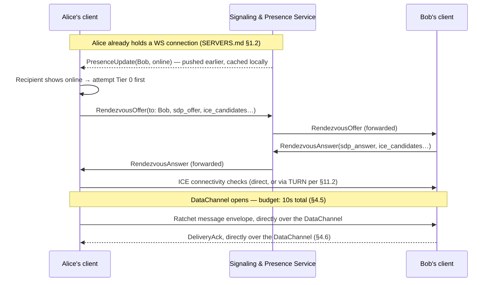
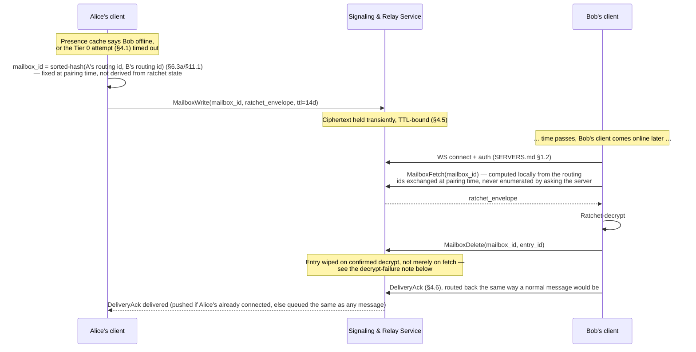
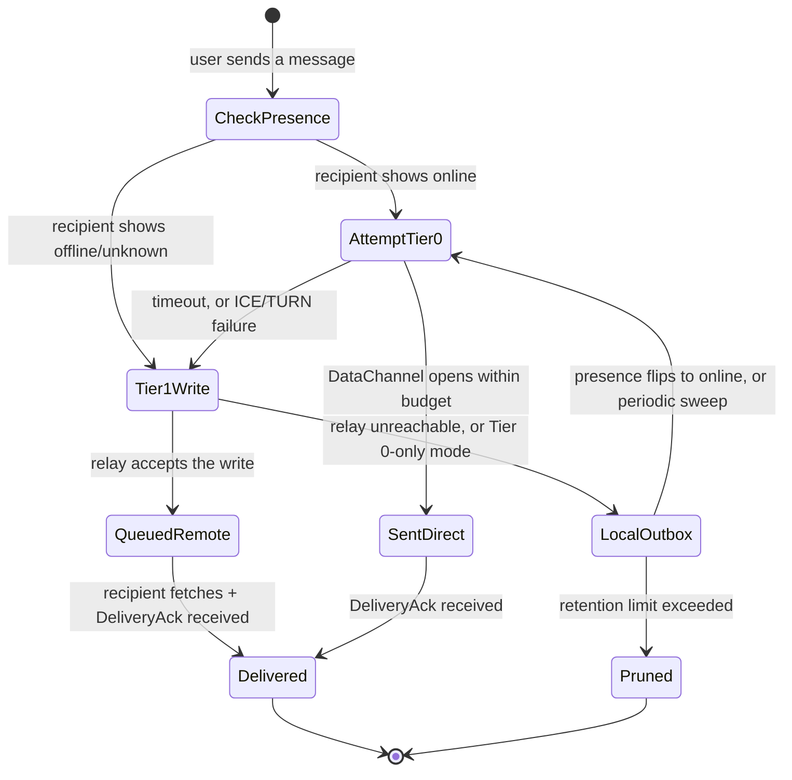

# DRAtchet — Architecture & Design

Status: **design draft, no code yet**
Target platforms: Windows, macOS, Linux (desktop)

See [`MESSAGE_SCHEMA.md`](MESSAGE_SCHEMA.md) for the concrete wire formats
referenced throughout (prekey bundle, ratchet message envelope, X3DH init,
pairing messages, presence protocol, recovery backup entry), and
[`SERVERS.md`](SERVERS.md) for the two optional server components (the
Signaling & Presence Service, and the Tier 2 Recovery Store) in full
detail, plus the Group Coordination Service (§13, v2) that group chat adds
as a mandatory third.

## 1. Recap: why "a fresh PGP keypair every message" doesn't work

The original idea was: encrypt every message with classic OpenPGP public-key
encryption, alternate which side's keypair is "active" every other message,
and throw away each private key the instant it's used.

That breaks under real messaging conditions:

- **Queue depth > 1.** If Alice sends two messages before Bob replies (common —
  offline recipient, slow reply, burst of messages), message #2 has no new
  public key to encrypt against, because in a strict alternating scheme the
  *next* key only exists once the recipient replies. The scheme is lock-step
  (ping-pong) and doesn't tolerate multiple in-flight messages, out-of-order
  delivery, or retries.
- **Cost.** Generating a new PGP keypair (especially RSA) and doing a full
  asymmetric encrypt/decrypt on *every single message* is orders of magnitude
  more expensive than symmetric crypto — noticeable latency and battery/CPU
  cost at chat volumes (this is exactly why nobody does this for real-time
  messaging).
- **Async delivery.** A store-and-forward server, multi-device, or a
  recipient who's offline for a while all need many messages to be encrypted
  and queued *before* any reply-driven key rotation could happen.

**This is a solved problem** — it's what the Signal Protocol's **Double
Ratchet** algorithm exists for. DRAtchet adopts Double Ratchet as the
key-rotation model: long-term identity, key discovery/verification, and
signing are handled by a raw signing keypair (§3.1) used only where that
cost is actually worth paying — never as a per-message asymmetric
operation.

## 2. Design goals

1. Forward secrecy: compromise of a current key must not expose past messages.
2. Post-compromise (self-healing) security: after a compromise, the session
   heals itself once both sides exchange a couple more messages.
3. Tolerate real-world queueing: offline recipients, bursts, out-of-order
   delivery, retries — without breaking decryption or blocking on lock-step
   replies.
4. Every symmetric message key is single-use and is deleted immediately after
   one encrypt/decrypt.
5. Identity and key-agreement material is raw, auditable, exportable key
   material (Ed25519 signing + X25519 Diffie-Hellman) — not wrapped in a
   heavier certificate format — but never as a per-message bottleneck.
6. Native desktop app on Windows, macOS, Linux from one codebase.
7. Peer identity must be authenticated out-of-band (in-person QR, or a
   remote single-use pairing code) before any conversation — 1:1 or group —
   can exchange application messages; trust-on-first-use is never a usable
   state, not just a discouraged one (§6.2).
8. Message history is unrecoverable by default; recovery is only ever an
   explicit, mutual, per-conversation opt-in.

## 3. Cryptographic protocol

### 3.1 Identity keys

Each user has one long-term Ed25519 signing keypair. This is the key a
user backs up, the key behind their fingerprint, and the key used to sign
everything below. It is **never** used to encrypt message content
directly, and it is raw key material — not wrapped in an OpenPGP or X.509
certificate.

**Why not OpenPGP (v0 tried it, then dropped it, `core/src/identity.rs`):**
an earlier v0 iteration carried this as a full OpenPGP (RFC 9580)
certificate via `sequoia-openpgp`. Two frictions led to dropping it rather
than working around them. First, OpenPGP's ECDH packet format wraps a
*symmetric session key* directly (per RFC 9580's ECDH-KEM construction);
it isn't built to hand out a raw X25519 scalar for an arbitrary external
Diffie-Hellman the way X3DH needs (§3.2) — reaching into `sequoia-openpgp`'s
internal MPI representation to extract one anyway would have been exactly
the kind of shortcut worth avoiding without interop test vectors to check
it against. A future post-quantum (ML-KEM) key would hit the same
packet-shaped-hole problem. Second, the certificate/policy/subkey-search
machinery was real ongoing complexity for a property (OpenPGP-tool
interoperability) nothing in this design actually uses — no stock OpenPGP
client can decrypt a ratchet-derived session anyway (§3.5 already made
this same call for message bodies). Raw key material sidesteps both: it's
just bytes in this project's own extensible CBOR schema (`MESSAGE_SCHEMA.md`
§1), so a new key type — including a future ML-KEM term — is a new
optional field, not a packet-format workaround, and `identity.rs` shrank
substantially once the certificate machinery was gone.

The X3DH identity DH key (`IK`, §3.2) is a **separate** X25519 keypair,
not derived from the Ed25519 signing key — Ed25519 and X25519 are
different key types for different purposes (signing vs. Diffie-Hellman),
so keeping them apart is the right call independent of whichever
certificate format (or lack of one) wraps them.

### 3.2 Session establishment — X3DH

Modeled on Signal's X3DH, with key material carried as raw, fixed-size
key bytes rather than any packet format:

- Each user publishes a **prekey bundle** to the relay server:
  - Identity key (long-term).
  - One **signed prekey** (X25519 keypair), signed by the identity key,
    rotated periodically (e.g. weekly).
  - A batch of **one-time prekeys** (X25519 keypairs), uploaded in
    bulk; the server hands out one per new session and then deletes it.
- To start a session, the initiator fetches the recipient's bundle, verifies
  the signed prekey's signature, and performs the X3DH DH computations
  (IK_A×SPK_B, EK_A×IK_B, EK_A×SPK_B, EK_A×OPK_B) to derive a shared secret
  via HKDF. This becomes the Double Ratchet **root key**.
- The consumed one-time prekey is deleted server-side immediately and
  client-side once the session is confirmed — this is the genuinely
  single-use, discard-after-use keypair in the system.

### 3.3 Message layer — Double Ratchet

Once the root key exists, per-message crypto is entirely symmetric:

- **Symmetric-key ratchet:** every message advances a one-way HMAC chain
  (`KDF_CK`) to derive a per-message key. That message key encrypts exactly
  one message (AEAD: ChaCha20-Poly1305 or AES-256-GCM) and is deleted right
  after use — this is where "single-use key, discarded after one message" is
  fully and cheaply true.
- **DH ratchet:** each message header carries the sender's *current* ratchet
  public key (a raw X25519 key) — this is the
  "follow-on message includes the latest public key for the next
  transmission" behavior from the original brief. A *new* DH keypair is
  generated, and the ratchet steps forward (new root + chain keys), the first
  time a side replies after receiving — i.e., key rotation is driven by
  turn-taking, not by a literal count of messages. The old ratchet private
  key is discarded the moment the new one replaces it.
- **Skipped-message key cache:** because the chain KDF is a one-way function,
  keys can be derived ahead and cached (bounded by `max_skip`) for messages
  that arrive out of order or after a backlog. **This is the direct answer
  to the queue-depth question**: Double Ratchet was built to tolerate
  exactly the burst/offline/out-of-order conditions that break a strict
  alternating-PGP-keypair scheme. `max_skip` is configurable per session
  (v0, `core/src/ratchet.rs`), constrained to `[50, 150]`
  (`MIN_MAX_SKIP`/`MAX_MAX_SKIP`) rather than left as an arbitrary integer:
  the floor keeps an *ordinary* queued burst — the exact scenario this
  design exists to handle — from tripping the bound in normal use; the
  ceiling caps how much wasted skipped-key derivation a single hostile or
  corrupted envelope's `pn`/`n` field (§11.8) can force before the AEAD
  check ultimately rejects it. A value outside that range is rejected at
  construction (`Error::InvalidMaxSkip`), not silently clamped. Default is
  100.

### 3.4 Key lifecycle summary

| Key | Lifetime | Discarded when |
|---|---|---|
| Identity keypair | Long-term (years) | User rotates/revokes identity |
| Signed prekey | Days–weeks | Replaced on rotation schedule |
| One-time prekey | Single session handshake | Immediately after session establishment |
| DH ratchet keypair | Until the peer's next reply | Replaced by next DH ratchet step |
| Per-message symmetric key | Single message | Immediately after that message is encrypted/decrypted |
| Remote pairing code (§6.4) | Single verification attempt, ~10 min TTL | On first successful match, or expiry — whichever first |
| Conversation recovery key (§7, only while the *effective* policy is A or B) | Life of the conversation's effective recovery policy | Automatically, the moment the effective policy reaches Profile C (§7.2/7.3) — individual stored entries are also auto-purged at that point, not just the key |

**"Discarded" means zeroized in memory, not just dropped from scope**
(v0, `core/src/ratchet.rs`): the root key, chain keys, and skipped-message
keys are wrapped in `zeroize::Zeroizing`, and DH secrets (`StaticSecret`,
`SharedSecret`) zeroize themselves via x25519-dalek's `"zeroize"` feature —
both overwrite their storage on drop rather than leaving key material
sitting in freed memory for a debugger or core dump to find.

**Replenishment.** A published bundle's one-time prekeys (`PublishBundle`,
`ONE_TIME_PREKEY_BATCH = 10`, `app/src/lib.rs`) are consumed one per
`FetchBundle` and never replaced by the server on its own — a long-lived
account that only ever registers once will eventually exhaust its pool,
after which every subsequent X3DH handshake against it silently drops the
one-time-prekey DH term, weakening that session's forward secrecy with
nothing telling either side it happened. `FetchOwnPrekeyCount` (a small,
authenticated, field-less query — deliberately carrying no target-identity
parameter, so it can never become a new enumeration/timing oracle for
*other* accounts' pool sizes, per §11.8) lets a client check its own
remaining count; `dratchet_app::replenish_prekeys_if_low` polls it on a
slow cadence (the Tauri client checks once a minute, §"Live networking" in
`ui/src-tauri/src/lib.rs`) and, once the pool has drained to
`PREKEY_REPLENISH_THRESHOLD = 3`, republishes a fresh full batch under the
exact `username#NNNN` already on record — the same
`publish_under_candidates` path `reconcile_own_profile` (§6.1) uses to
reclaim a handle after a restart, reused here to top up instead. This
costs nothing extra: `server/src/ws.rs`'s `publish_bundle` never requires
proof-of-work for a rotation/republish of an already-owned identity, only
for a brand-new registration, so periodic replenishment is free to call
often.

**Local cleanup on republish.** Because a directory's `publish_bundle`
replaces the previously-published one-time-prekey batch wholesale rather
than merging into it, every id from a superseded batch becomes permanently
unreachable — no future `FetchBundle` will ever name it again. Early
versions of `generate_one_time_prekeys` (`core/src/account.rs`) didn't
account for this: it only ever inserted, so those now-unreachable secrets
stayed in `Account.one_time_prekeys` forever, growing by a full batch on
every replenish cycle with nothing to evict them — unlike the ratchet's
skipped-message-key cache (below), which has an explicit bound. Fixed:
`generate_one_time_prekeys` now clears the map before inserting the new
batch, matching the directory's own replace-not-merge semantics; covered
by `core/src/account.rs`'s `republishing_drops_the_old_batchs_now_unreachable_secrets`
and `many_replenish_cycles_never_grow_storage_past_one_batch` tests.

### 3.5 Message wire format: why a minimal custom format, not a general-purpose one

Both **key material** (identity keys, prekeys, §3.1/3.2) and **message
bodies** (the ciphertext for an individual chat message) end up as raw,
fixed-size fields in this project's own minimal schemas — CBOR for
key/handshake material (`MESSAGE_SCHEMA.md` §1/§3), a fixed binary layout
for the hot-path ratchet envelope (`MESSAGE_SCHEMA.md` §2). Neither is
wrapped in a general-purpose packet format like OpenPGP's. This was a real
decision, not a default — an early v0 iteration *did* carry identity keys
and prekeys as OpenPGP (RFC 9580) packets (§3.1 explains why that was
dropped) and considered going further to make message bodies themselves
valid OpenPGP messages too (a Public-Key or Symmetric-Key Encrypted
Session Key packet followed by a Symmetrically Encrypted Integrity
Protected Data packet — the same structure a `.pgp` file GnuPG produces).
The comparison below is why that path was rejected for message bodies,
and — with hindsight — why the same reasoning ended up applying to keys
too:

| | Full OpenPGP-style packet format | Minimal custom format (adopted) |
|---|---|---|
| **Per-message overhead** | Multiple packet headers + MPI-encoded fields — noticeably larger than the payload for short chat messages | Fixed ~40–50 byte header (32-byte pubkey + two counters) + ciphertext + 16-byte tag — minimal |
| **Where ratchet metadata lives** | No natural home — the DH pubkey/counters would have to be smuggled into Notation Data subpackets or a custom packet type, which itself breaks strict standard-compliance | First-class fields in a header designed exactly for what Double Ratchet needs |
| **Real interoperability** | Looks standard, but a generic OpenPGP/GnuPG client still can't decrypt it — the "session key" is ratchet-derived, not produced by a normal public-key encryption step, so the compatibility is mostly cosmetic | None claimed — doesn't pretend to be readable by outside tools |
| **Parsing surface / attack surface** | Larger — full packet parser, MPI decoding, subpacket handling per message | Small, fully controlled, easy to fuzz/test exhaustively — see `core/fuzz/` |
| **Engineering cost** | Reuses a standardized format for *framing*, but key derivation is custom either way — you inherit format complexity without shedding protocol-design responsibility | Faster to implement correctly; entire format fits in a page |
| **Future flexibility** | If a hard requirement later appears to bridge to PGP/MIME email or produce gpg-decryptable archives, this gets partway there | A new field (e.g. a future ML-KEM key/ciphertext, §11.4) is additive — no packet-format workaround needed |
| **Tooling** | Can reuse existing OpenPGP packet inspectors for debugging | Debug/inspection tooling must be custom-built (small effort given the format's size) |

**Decision (settled for both keys and messages; revisit only if a concrete
interop requirement appears):** a minimal custom format throughout. The
claimed interoperability benefit of OpenPGP-shaped message framing is
largely illusory — a stock OpenPGP client still can't decrypt a
ratchet-derived session key — so it doesn't justify the extra size,
parsing surface, and awkward header-metadata fit. Message bodies never
leave the app anyway (they're deleted from the ratchet the instant they're
used, per §3.4), so there's no real-world scenario where a generic PGP
tool needs to read one — and, per §3.1, the same "no real interoperability
benefit, real engineering and future-extensibility cost" calculus turned
out to apply just as much to key material once it was examined directly.

There's a second reason to prefer AEAD over a signed message that has
nothing to do with size: **deniability**. See §11.6.

## 4. System architecture: a serverless-first, tiered model

The earlier draft assumed a single always-present relay server doing three
jobs at once: routing/discovery, offline store-and-forward, and (implicitly)
being the thing a recovery backup would sit on. Splitting those three jobs
apart is what makes "serverless" and "recoverable" both possible — they turn
out to be independent decisions, not one all-or-nothing server. Message
schemas referenced below are in
[`MESSAGE_SCHEMA.md`](MESSAGE_SCHEMA.md).

### 4.1 Tier 0 — pure peer-to-peer (strictest serverless)

- Clients connect directly over a **WebRTC DataChannel** (available in all
  three target webviews — WebView2, WKWebView, WebKitGTK — no native
  networking code needed, consistent with the "one core, thin OS glue"
  approach in §5).
- WebRTC still needs a **rendezvous step** before a direct connection
  exists: exchanging ICE candidates/SDP, and NAT traversal (STUN always,
  TURN as a relay-of-last-resort behind symmetric NATs). None of this
  carries message content — only connection-setup metadata and prekey
  bundles (§1 of `MESSAGE_SCHEMA.md`), both already meant to be public.
  A minimal, stateless signaling service can host this (or a DHT — see §4.4
  open question); either way it holds no ciphertext, ever.
- **Delivery requires both peers online at overlapping times.** If the
  recipient isn't reachable, the message queues **locally on the sender's
  device** and retries on the next connection attempt. This is the honest
  cost of Tier 0, and it's the same queue-depth question from the very
  first design pass, resurfacing at the transport layer instead of the
  crypto layer: the Double Ratchet's skipped-message-key cache (§3.3) still
  handles out-of-order/backlogged *decryption* just fine once messages
  arrive — Tier 0's limitation is purely "when can delivery happen at all,"
  not "can the crypto keep up."
- **Zero recovery, by construction** — there is no third party anywhere in
  this path holding ciphertext, so there's nothing to recover from if a
  device is lost. This is the mode the task description means by "even if
  that means foregoing the possibility of recovering messages."
- **Trade-off worth naming plainly: direct P2P reveals IP addresses between
  the two people talking**, unlike a centrally-routed service (Signal,
  WhatsApp) where users never learn each other's IP. This is the flip side
  of removing the server from the path — see §11.2 for the mitigation
  (a user-facing toggle to force relaying even when direct is possible).

**Concrete connection flow:**



Once the DataChannel is open, WebRTC's SCTP-based data channel already
gives reliable, ordered delivery for as long as both sides stay connected —
no relay, no TTL, no delivery token needed for this path. The signaling
service's only role was the rendezvous handshake at the top; it's out of
the loop for the rest of the conversation until the next rendezvous is
needed (e.g. after a network change forces reconnection).

### 4.2 Tier 1 — ephemeral relay-assisted (pragmatic default)

Same as Tier 0, plus one addition: an optional **ephemeral store-and-forward
hop** to bridge the gap when both peers aren't online at the same time,
without becoming a durable archive.

- Implementable as genuinely serverless-hosted infrastructure (e.g.
  Cloudflare Durable Objects/KV, or an equivalent self-hostable minimal
  relay) — no long-running process to patch or operate, but it is still
  third-party infrastructure in the delivery path, unlike Tier 0.
- Holds ciphertext **transiently**: short TTL (days, not months) and/or
  auto-wipe on delivery acknowledgment — a mailbox, not an archive. The
  relay envelope wraps the opaque ratchet message envelope with only
  routing metadata: a `mailbox_id`, a TTL, and a delivery token. `mailbox_id`
  is **not** a static per-device inbox — it's a per-pairing **session
  routing id**, generated fresh out-of-band at pairing time (§6.3a) and
  hashed pairwise (`core::conversation_id`-style, sorted) rather than
  derived from either identity's long-term key material or from evolving
  ratchet state. (An earlier draft of this section derived it from ratchet
  state directly — `HKDF(root_key, "mailbox" ‖ direction)` — which turned
  out not to work: §11.1 has the full account of why, found while
  implementing the first reference client.) See §11.1 for why a static,
  identity-derived id would still let the relay trivially see "how many
  distinct contacts write to this device" — the fresh-per-pairing routing
  id avoids that by never being tied to either party's long-term identity
  at all. This wrapper is a thin, tier-specific addition on top of the
  ratchet message envelope defined in §2 of `MESSAGE_SCHEMA.md`, which
  stays identical across all tiers — the relay never needs to understand
  it, only pass it along.
- This is the recommended **default** for v1: pure Tier 0 is more
  privacy-strict but has a materially worse offline-delivery experience for
  an MVP; Tier 1's relay never sees plaintext or ratchet state and holds
  ciphertext only transiently, so it stays close to Tier 0's guarantees
  while being usable when both people aren't online together.
- Still **zero durable recovery by default** — a Tier 1 relay auto-wiping
  ciphertext after delivery is not a backup, even though it technically
  "stores" something briefly. That distinction should be explicit in any
  user-facing description of Tier 1, so it doesn't get conflated with §4.3.

**Concrete mailbox flow:**



- **Delete-on-decrypt, not delete-on-fetch:** the recipient's client only
  issues `MailboxDelete` after the fetched envelope decrypts successfully.
  If decryption fails (corrupted transit, a bug, or an out-of-window replay)
  the entry is left in place for one retry rather than being silently lost
  on a fetch that didn't actually succeed end-to-end.
- **Pull on reconnect, push if already connected:** a client always issues
  `MailboxFetch` for its active conversations' current `mailbox_id`s right
  after establishing its WebSocket connection (covers "was offline, came
  back"). If the recipient is *already* connected when a write lands, the
  service can additionally push it immediately over the open WebSocket —
  push-if-connected is a latency optimization, not a substitute for the
  pull-on-reconnect path, which is what actually guarantees delivery.
- See §4.5 for the exact retry/backoff parameters and §4.6 for how
  `DeliveryAck` prunes the sender's local outbox.

### 4.3 Tier 2 — opt-in recovery layer (graded profiles, self-hostable)

Layers on top of *either* Tier 0 or Tier 1 — orthogonal to which delivery
tier is in use. This is exactly the §7 recovery design, restated with the
hosting question now answered: the durable, decryptable-with-the-recovery-
key backup store doesn't need to be a DRAtchet-operated service at all, and
— now specified in full in [`SERVERS.md`](SERVERS.md) §3 — it doesn't need
to be *shared* between the two participants either. Each side configures
their **own** recovery destination (their own self-hosted server or cloud
bucket); what actually gets written there is governed by the conversation's
*effective* policy — the more restrictive of the two sides' Profile A/B/C
choices (§7.2) — but the storage itself stays single-owner, which keeps
blast radius, deletion semantics, and auth all simpler than a shared store
would — see `SERVERS.md` §3 for the full reasoning and API.

Tier 2's activation is a conversation-level outcome computed from both
sides' recovery profiles (§7), not a manual accept step — it never happens
as a side effect of picking a delivery tier, and picking Tier 0 for
delivery doesn't preclude Tier 2 for recovery or vice versa.

### 4.4 Cross-cutting notes

- Large backlog handling is unchanged from the original design regardless
  of tier: the skipped-key cache is bounded (`MAX_SKIP`); if a recipient is
  unreachable long enough to exceed it, the client falls back to a fresh
  X3DH session establishment rather than growing the cache unbounded. Tier 0
  additionally needs a local outbox retention/pruning policy on the
  *sender* side, since undelivered messages accumulate there instead of on
  a server.
- Prekey bundle discovery (`username#NNNN` → bundle, §6.1) needs *some*
  discoverable location even in Tier 0/1 — recommend the same minimal
  signaling service also serves this (public-key material only, low
  sensitivity, much simpler than a full DHT) rather than standing up a
  second piece of infrastructure. Flagged as an open decision in §10 if a
  fully decentralized (DHT-based) directory turns out to matter more than
  the simplicity of a small serverless KV store.
- **Online-status/presence** is a fourth job that same signaling service
  can hold: whether a contact is currently reachable, used both for UX (a
  presence indicator) and to decide whether to attempt Tier 0 direct
  delivery or go straight to a Tier 1 mailbox/local outbox. Full design —
  connection/auth model, presence visibility rules, and why it stays
  ephemeral (in-memory, not logged) rather than becoming another durable
  store — is in [`SERVERS.md`](SERVERS.md) §1.
- Multi-device and group chat remain **out of scope for v1** (Roadmap, §9)
  — both interact with the tiering question (a DHT or relay mailbox model
  changes shape once "recipient" means multiple devices) and are better
  tackled once the 1:1 ratchet and delivery tiers are solid.

### 4.5 Tier selection & fallback state machine

Per outgoing message, not per conversation — presence can change between
one message and the next, so the tier decision is re-made each time rather
than pinned for the conversation's lifetime.



Concrete parameters (v1 defaults — all client-side/tunable, nothing here
requires relay-side coordination beyond the TTL):

| Parameter | Default | Rationale |
|---|---|---|
| Tier 0 connection attempt budget | 10s total | STUN-only paths typically resolve in under 2s; TURN fallback adds a few more — 10s covers the realistic worst case without stalling the send indefinitely |
| ICE gathering sub-budget | 5s | Within the 10s total |
| Tier 1 mailbox TTL | 14 days | Long enough for a genuinely offline recipient (device off, vacation), short enough to keep "mailbox, not archive" true — see §12 for how a server-based deployment might reasonably extend this |
| Tier 1 write retry backoff | 1s → 60s exponential, capped | For a transiently unreachable relay, not a permanently down one |
| Local outbox retention | 500 messages/conversation **or** 30 days, whichever hits first | Oldest-pruned-first; pruning surfaces a visible "couldn't be delivered" notice rather than failing silently |
| Retry trigger for a stalled outbox | Event-driven on a presence transition to online, plus a 5-minute periodic sweep while foregrounded | Avoids polling the relay/peer on a tight loop while still self-healing if a presence event was missed |

### 4.6 Delivery acknowledgment

A message being *sent* isn't the same as it being *delivered* — the sender
needs to know when to stop retrying (§4.5's `LocalOutbox`/`QueuedRemote`
states) and the UI needs something to base a delivery indicator on. A new
schema message, `DeliveryAck` (§7 of `MESSAGE_SCHEMA.md`), closes this loop:

- Sent by the recipient's client the moment a ratchet envelope **decrypts
  successfully** — not on mere receipt, so a corrupted-in-transit message
  never gets falsely acked.
- Routed back exactly like a normal message would be: over an open Tier 0
  DataChannel if one exists, otherwise written to a Tier 1 mailbox the same
  way — `DeliveryAck` gets no special-cased transport.
- On receipt, the sender prunes the corresponding entry from its local
  outbox/retry queue (§4.5) and the UI can show a delivered indicator.
- **This is deliberately *delivery*, not *read*.** Whether the human on the
  other end has actually looked at the message is a separate, more
  privacy-sensitive signal (Signal, WhatsApp, and iMessage all draw exactly
  this line, and all let users turn read receipts off independently of
  delivery confirmation). DRAtchet's v1 scope is delivery acknowledgment
  only; a `ReadReceipt` message would follow the identical pattern but
  should default to **off**, user-toggleable per conversation, tracked as
  an open decision in §10 rather than shipped as an unconditional default.

## 5. Client / platform architecture

**Decided:** one stack, one codebase, for all three target platforms —
**Tauri (Rust core) + web-based UI**, shipping natively on Windows, macOS,
and Linux. No per-OS fork and no separate Electron track; platform
differences are handled as integration details within the single core, not
as different stacks.

- Rust core handles all cryptography and ratchet state — no crypto in the UI
  layer. Candidate crates: `ed25519-dalek` (identity signing), `x25519-dalek`
  (ECDH), `hkdf` + `hmac` + `sha2` (ratchet KDFs), `chacha20poly1305` (AEAD).
  All are audited, widely used RustCrypto ecosystem crates rather than
  hand-rolled primitives — and all pure Rust, so the crypto core has no
  native system dependency to build or ship.
  - Rust over Electron/Node for this project specifically because the crypto
    core benefits from memory safety and this mature, audited crate
    ecosystem; Tauri's footprint and update size are also substantially
    smaller than Electron's.
- Local storage (implemented — `store/`, Phase 1.5): a pure-Rust embedded
  database (`redb`) for accounts, contacts, ratchet sessions, and messages,
  with every value encrypted at rest via `chacha20poly1305`. Originally
  specified here as SQLite (SQLCipher-encrypted) — corrected once it came
  time to actually build it: SQLCipher is a native C dependency (itself
  needing OpenSSL or an equivalent crypto provider), and the project has
  stayed deliberately pure Rust with zero native/C dependencies since
  dropping OpenPGP/sequoia (§3.1) — the same reasoning applies here, not
  just to identity keys. The encryption key itself is still sealed via the
  OS credential store as designed — Windows DPAPI, macOS Keychain, Linux
  Secret Service (libsecret) — not a user password alone, with a
  passphrase-derived (Argon2id) fallback when no OS credential store is
  available (the Linux caveat two paragraphs down already anticipated
  needing one).
- IPC between the web UI and Rust core stays within Tauri's command bridge;
  the UI never handles raw key material, only decrypted message text and
  metadata.
- **Per-platform integration points** (same core logic, different OS glue):
  - *Windows*: DPAPI-backed secret storage; camera access for QR scanning
    (§6) via the WebView2 webview's `getUserMedia`.
  - *macOS*: Keychain Services-backed secret storage; camera access via
    WKWebView's `getUserMedia` (requires the standard camera-usage
    entitlement/Info.plist string).
  - *Linux*: Secret Service API (libsecret) for secret storage; camera
    access via WebKitGTK's `getUserMedia`. Caveat: not every Linux desktop
    environment runs a Secret Service provider by default (minimal window
    managers, some headless/remote setups) — the client needs a graceful
    fallback (e.g., a local passphrase-derived key-encryption-key) rather
    than failing to start when libsecret is unavailable.
  - QR display/scanning itself needs no native camera code on any platform
    — a webview `getUserMedia` call plus in-app QR encode/decode (pure
    Rust or JS library) covers all three.

## 6. Identity addressing & peer authentication

### 6.1 Addressing: `username#NNNN`

Each account has a self-chosen **username** plus a random **4-digit
discriminator**, e.g. `alice#4821` — regenerated on collision within that
username (Discord's original scheme). The directory server maps
`username#NNNN` → account ID → current prekey bundle (§3.2). This address is
how you *locate* someone's prekey bundle; it is **not** proof of who
controls it — the server could in principle be compromised or coerced into
serving a substituted bundle, which is exactly what §6.2 defends against.
(Namespace note: a 4-digit discriminator caps a single username at 10,000
accounts before it runs out — fine at the scale this project is targeting;
flagged in §9 as revisitable if that ever becomes a real constraint.)

**Implemented** (`dratchet_app::publish_own_bundle`/`rename_own_profile`):
self-registration and rename are both a `PublishBundle` publish under a
chosen username — a rename is nothing more than publishing again under a
new one, no separate wire message. "Regenerated on collision" is a
client-side behavior, not a server one: the wire protocol has the
*client* propose a discriminator and the server only reject a collision
(`Error::UsernameTaken`, surfaced via an explicit `Ack`/`Error` response
`PublishBundle` didn't originally have — added specifically so a real
client can detect the collision and retry), so `publish_own_bundle` is
what actually makes the "regenerated on collision" promise true in
practice, retrying with a fresh random discriminator a few times before
giving up. Renaming also releases the account's *previous* username in
the directory (`server/src/ws.rs`'s `publish_bundle`) — a real,
independently-found gap in the original implementation where a stale
handle would stay permanently resolvable, fixed as part of building
rename rather than left for later.

**The restart/reclaim race, and how it's closed — at the root
(`server/src/persistence.rs`) and again defensively on the client
(`dratchet_app::reconcile_own_profile`/`announce_profile`).** The
directory (`server/src/state.rs`'s `Inner`) used to be in-memory only,
matching this project's "no durable message storage" posture applied to
the directory as well as mailboxes — but that posture had a real cost
here a restart forgot every registration at once, opening a window: a
device that registered `alice#4821` still believed it owned that handle,
but the directory no longer did, so anyone else who requested
`alice#4821` got it. This is a genuinely different failure from the live
collision `Error::UsernameTaken`/§6.1 above, which is already handled
atomically (a single write-lock spans the whole check-then-insert in
`publish_bundle`, so two clients racing for the same handle *right now*
can never both win it) — the restart case is temporal, not concurrent:
the original owner simply isn't connected yet to defend its claim.

**Root fix**: the directory is now persisted (`server/src/persistence.rs`,
`docs/SERVERS.md` §1.4) — every registration, rename, and rotation, plus
each one-time prekey `FetchBundle` consumes, is written through to an
embedded single-file store, and reloaded at startup. A restart with the
directory's file on durable storage no longer forgets anything, which is
the actual fix; everything below is defense-in-depth for what that alone
still doesn't cover: an operator who hasn't pointed `--directory-db` at
storage that survives a restart (the default path is the working
directory, which a container's own ephemeral filesystem does not
survive — the shipped Helm chart doesn't mount a persistent volume for it
yet), and a squatter who is *already connected* at the exact instant a
restart happens, racing the original owner's reconnect either way.

Narrowed further by reconciling on every connect, before anything else
runs:

- `reconcile_own_profile` is called once at startup, immediately after
  `authenticate` and before any other use of the connection. It re-
  publishes this device's stored `OwnProfile`, trying the *exact*
  username **and** discriminator already on record first — a genuine
  reclaim attempt, not a fresh registration — and only falls back to
  `publish_own_bundle`'s usual random-discriminator retry if that specific
  reclaim is rejected with `Error::UsernameTaken` (i.e. someone else
  already claimed it since the directory forgot this device owned it).
  Returns `ProfileReconciliation::Unchanged` in the common case (nothing
  to tell anyone), or `DiscriminatorChanged { old, new }` when the reclaim
  failed and a different discriminator had to be picked — the one case a
  caller needs to act on.
- On `DiscriminatorChanged`, the Tauri app surfaces an in-app notice to
  the profile owner directly (a toast: "your handle changed from
  `alice#4821` to `alice#7290`") and calls `announce_profile` for every
  already-`Verified` contact, sending a `ProfileAnnounce` control message
  (`core/src/payload.rs`, `docs/MESSAGE_SCHEMA.md`) over each
  conversation's *existing* ratchet. This is a purely cosmetic,
  display-label update — `conversation_id`, X3DH, and all ratchet state
  are derived from the long-term identity fingerprint (§3.1/§3.2), never
  from `username#NNNN`, so a handle change requires no session
  re-establishment and no key rotation of any kind. A receiving client
  records the new handle (`Db::record_peer_profile`) and, if it genuinely
  differs from what it already knew (first-time-learning a handle — e.g.
  right after pairing — is deliberately not treated as a "change"),
  surfaces its own toast: "`alice#4821` is now `alice#7290`."
- On a properly durable directory (the common case now), this rarely has
  anything to do — `reconcile_own_profile` just reclaims the same
  discriminator and returns `Unchanged`. It earns its keep in exactly the
  two remaining cases above: an operator whose directory storage isn't
  actually durable, and the already-connected-squatter race a persisted
  directory can't fully close by itself either.

### 6.2 Trust levels

**Verification is mandatory, not opt-in.** DRAtchet does not use
trust-on-first-use: a conversation — 1:1 or group — cannot exchange any
application messages (chat content) until the parties involved have
completed verified key exchange. This is a deliberate reversal of most
consumer messengers' default ("chat immediately, flag risk later") in
favor of the opposite trade — no unverified messaging exists as a usable
state at all. See §6.5 for exactly what this blocks and what it doesn't.
**Implemented (Phase 1.6.1, `store::gate`)**: `encrypt_gated`/
`decrypt_gated` enforce this directly — chat content is refused both ways
for anything other than a `Verified` contact, while the ratchet itself
(and non-chat protocol messages, like §11.1's routing-id exchange) keeps
running underneath exactly as §6.5 describes.

Every contact is either:

- **Pending** (transient, not usable for messaging): the client has a
  prekey bundle for `username#NNNN` fetched from the directory server, and
  may have an X3DH/ratchet session already established against it, but its
  fingerprint hasn't been confirmed through either path below yet. A
  conversation sits here — visible in the UI as "verification required,"
  never as an active chat thread — until it resolves to Verified. There is
  no timeout that silently promotes a Pending contact to usable; the only
  way out is completing Path 1 or Path 2, or the user abandoning the
  attempt. **Path 2 (§6.4) as actually implemented never produces this
  state at all** — its pairing-code gate gets checked *before* any contact
  is created, so a Path 2 attempt either lands as `Verified` immediately
  or leaves no contact (and no trace) at all; `Pending` remains reachable
  only via Path 1 (§6.3)'s in-person QR flow, or a session established
  some other way (e.g. this document's own dev-seeding tooling) that
  hasn't been confirmed yet.
- **Verified**: the identity key's fingerprint has been confirmed through
  one of the two paths below, and is pinned locally. Only a Verified
  contact's conversation can send/receive application messages. If the
  peer's identity key later changes, the contact reverts to "unverified —
  identity changed" — back to a non-usable state, not a soft warning banner
  — and must be re-verified before messaging resumes, the same event
  Signal flags as a safety-number change, just with a harder consequence
  here.

### 6.3 Path 1 — in-person QR exchange (strongest)

Each device can render a QR code encoding `username#NNNN` + the SHA-256
fingerprint of its current identity key (+ a short random nonce so a stale
photographed code is visibly different from a fresh one). Both people scan
each other's codes in the same physical session; each client compares the
scanned fingerprint against the bundle it already has (or fetches fresh) for
that address — match marks the contact **Verified**; mismatch is a hard
stop, never silently marked verified. Because the fingerprint came straight
from a physically-present device, this path doesn't need to trust the
directory server at all — it's the strongest of the two.

**Implemented (Phase 1.6.3, `store::verification`)** as data layer: the QR
payload above (CBOR-encoded, with a 5-minute staleness window on the
nonce+timestamp) and rendering a real, scannable PNG via a pure-Rust QR
encoder. Not yet wired to a live camera scan or any GUI — that's the
eventual Tauri shell's job, out of reach in a display-less environment.
**This path never carries a routing id** — that's still true even though
§9/§11.1's mailbox-addressing fix does give v1 per-pairing routing-id
addressing already: the two routing ids are exchanged automatically, as an
ordinary encrypted protocol message (`RoutingIdAnnounce`,
`MESSAGE_SCHEMA.md` §7) sent the moment the X3DH session exists, over
`bootstrap_mailbox_id` (§11.1) — not something either person has to
physically relay through this QR. §6.3a's "QR carries the actual handshake
material" extension is a separate, later change (v2) that would remove the
directory from the critical path entirely, not a prerequisite for the
routing-id addressing v1 already has.

### 6.3a Path 1, extended — server-independent handshake + SAS liveness confirmation — **v2, future**

Two hardenings to Path 1 above, planned for a later pass, not v1. Both were
prompted by the same design question: what would it take for the
*directory server itself* to be removable from the pairing path entirely,
and for the pairing ceremony to resist an active attacker, not just a
stale/replayed code?

**1. QR carries the actual handshake material, not just a verifying
fingerprint.** As written, §6.3 still routes the *key exchange* through the
directory server: the client fetches a prekey bundle via `username#NNNN`
first (§4.1), and the QR code only carries a fingerprint to verify that
fetched bundle against. That means the directory server is still on the
critical path for establishing a session, even though it can't silently
substitute a bundle undetected (§6.3's "mismatch is a hard stop" already
covers that). The extension: the QR instead carries the full material
needed to run X3DH (or a simpler live mutual DH — see the open question
below) directly between the two devices — identity key, identity DH key,
and either a signed prekey or a fresh session-only ephemeral key — plus a
freshly-generated, single-use **session routing id**, separate from the
long-term identity fingerprint. The routing id (not the fingerprint) is
what gets hashed into the Tier 1 `mailbox_id` for this conversation
(`core::conversation_id`-style: a hash of both sides' routing ids, sorted),
so the relay never learns either party's long-term identity *or* gets to
correlate this conversation's traffic with any other conversation either
party has — a strictly better property than deriving routing from the
identity fingerprint directly, since the fingerprint may also be used
elsewhere (e.g. directory-based discovery for other contacts). Because the
routing id is freshly generated per pairing rather than derived from a
permanent identity, deleting a conversation genuinely retires that address
— re-pairing the same two people later mints a new one, rather than
recomputing the same deterministic value every time.

Open question, not resolved here: whether this reuses X3DH as-is (one
handshake code path shared with §6.4's remote pairing, where the responder
genuinely may be offline) or adopts a simpler live mutual X25519 exchange
specific to this synchronous, both-parties-present case (X3DH's signed-
prekey/one-time-prekey machinery exists specifically to support
*asynchronous* establishment, which isn't needed when both devices are
online in the same room). Leaning toward reusing X3DH for one shared
implementation rather than maintaining two handshakes, but flagging this
as a real fork rather than assuming it.

**2. A mandatory Short Authentication String (SAS) comparison, closing a
real gap in §6.3 as written.** §6.3's nonce only defends against replaying
a *stale* screenshotted code — it does not defend against a live relay
attack: an attacker who captures Alice's QR and relays it in real time to
a colluding device near Bob (and vice versa) could insert themselves as a
MITM, and both fingerprint comparisons would still "match" — each side
would just be matching against the attacker's substituted key rather than
each other's. The fix is the same one Signal's safety numbers, ZRTP, and
Bluetooth Secure Simple Pairing's numeric-comparison mode all use: after
the handshake, both devices independently compute a short, human-
comparable string (a handful of digits or words) derived from *both*
sides' actual exchanged keys, display it, and require the two humans to
confirm out loud that both screens show the same value before the contact
is marked Verified. If either side's key was substituted in transit, the
two computed values will not match — this is a strictly stronger version
of the same "match marks Verified; mismatch is a hard stop" mechanism
§6.2 already defines, not a new concept bolted on.

Precisely scoped, not oversold: this defeats an active network-level
relay/MITM in the exchange channel, cryptographically — a substituted key
provably produces a mismatched code. It does **not** fully defeat a
different threat sometimes bundled under "bot intervention": a fully
automated client script driving the pairing UI itself, impersonating a
human rather than attacking the channel. No purely software-side check
can rule that out with certainty — the same fundamental limit any anti-
automation measure (CAPTCHAs included) runs into once the attacker
controls the software making the confirmation. The honest best mitigation
there is UX friction (a deliberate, not-trivially-scriptable confirmation
step) that raises the cost of automating the ceremony, not a guarantee of
detecting it.

### 6.4 Path 2 — remote pairing via username + single-use code — **v1, implemented**

For contacts who aren't in the same room. **Atomic and code-gated, not a
two-step "TOFU-fetch, then upgrade Pending→Verified" flow** — an earlier
draft of this section described the latter (fetch a bundle by
`username#NNNN` first, land in `Pending`, exchange a code afterward to
upgrade), which was deliberately reworked: a leaked or guessed username
must never be enough, by itself, to make a contact/conversation attempt
appear on someone's device at all, `Pending` included. The code doesn't
confirm an already-established attempt here — it's the gate that decides
whether an attempt is ever allowed to exist locally in the first place.

1. The recipient's app generates a random, single-use, short-TTL numeric
   pairing code (e.g. 6 digits, ~10-minute expiry; generating a new one
   invalidates the previous code) — **before** the initiator does anything
   at all.
2. The recipient reads that code to the initiator over a channel they
   already trust more than the directory server (phone call, an existing
   verified DRAtchet conversation, in person, etc.) — the code is the "MFA"
   factor here: proof that the person on the other end of that channel
   currently controls the account, demonstrated by generating and reading
   it out.
3. The initiator enters `username#NNNN` and the code together, in one
   action. Their client looks up the bundle, runs X3DH, and sends a single
   message (`core::first_contact::FirstContactWire`,
   `MESSAGE_SCHEMA.md` §3) whose *encrypted* content carries the code —
   never the bare directory lookup on its own, and never anything the
   recipient has to separately notice and decide to respond to.
4. The recipient's device — scanning its own bootstrap inbox for exactly
   this shape of message — derives the session, decrypts, and checks the
   enclosed code against whatever it currently has stored. **A match**:
   both sides' contact is created already `Verified`, atomically, and the
   code is consumed. **Anything else** — wrong code, no code currently
   stored, expired, attempts exhausted, or a bad identity-binding
   signature on the message itself — and the attempt is discarded
   silently: no contact, no error, no reply, no trace left to reprocess.
   A prober gets no oracle for "does this account exist" or "was my guess
   close."
5. Attempts against a live code are rate-limited (exhausting the budget
   refuses even the correct code until a fresh one is generated) — a
   6-digit space is brute-forceable without that limit.

Be precise about what this does and doesn't prove: it authenticates that
whoever generated the code controls the account being paired with, and its
security rests entirely on the secrecy/integrity of whatever side channel
carried the code — the same property Signal's "compare safety number over a
phone call" verification has. It is not stronger than the channel used to
convey the code. A leaked or forwarded (not just guessed) code within its
TTL window would let someone else complete the exchange — same limitation
any one-time code has, mitigated by the short TTL and single-use
consumption, not eliminated.

**Implemented** (`store::verification::PairingCode` for the code itself,
persisted via `Db::save_pairing_code`/`load_pairing_code`/
`clear_pairing_code`; `dratchet_app::generate_pairing_code`/
`add_contact_by_username`/`receive_first_contact_attempts` for the flow
end to end): the initiator side (fetch, X3DH, send) and the responder
side (scan the shared bootstrap inbox — the same one §11.1 already
documents as shared across every not-yet-transitioned contact — for
`FirstContactWire`-shaped entries, verify, accept or silently discard)
are both real, network-facing code, not data-layer-only. As with §6.3,
the routing-id exchange this path's session needs (§11.1) travels
automatically as its own encrypted protocol message once the contact
exists, not through this pairing code.

### 6.5 What the mandatory gate blocks, and what it doesn't

Making verification mandatory (§6.2) changes when a conversation can send
or receive **application messages** — it doesn't change the cryptographic
handshake that has to happen first in order for there to be anything to
verify:

- **Still allowed pre-verification**: fetching a `username#NNNN` prekey
  bundle, running X3DH against it (§3.2), and establishing the resulting
  Double Ratchet session (§3.3). A Pending contact needs a real session —
  and the fingerprint that session's identity key produces — before there's
  anything to scan a QR code against or confirm with a pairing code. None
  of this exposes anything sensitive to a not-yet-verified peer: prekey
  bundles are already meant to be public (§4.1).
- **Blocked pre-verification**: the client refuses to hand any decrypted
  `payload_type = 0` (chat) content to the user, and refuses to encrypt and
  send one, while the contact is Pending. The ratchet session itself keeps
  running underneath — skipped-key derivation, DH ratchet steps — since
  refusing to *process* incoming envelopes at all would make verification
  itself impossible to complete over path 2 (§6.4), which is bound to "the
  current handshake's key material." What's gated is *release* of
  application content to and from the user, not the protocol machinery
  underneath it.
- **A mismatch is a hard stop, not a retry prompt**: exactly as §6.3
  already states for Path 1 — if the scanned or confirmed fingerprint
  doesn't match the session's actual identity key, the contact is never
  silently marked Verified. The user sees a clear failure and has to
  investigate (wrong code, compromised directory, active attack) before
  trying again, the same posture §6.2's "identity changed" case takes.
- **Both paths (§6.3, §6.4) satisfy the gate** — the mandatory requirement
  is "verified," not "verified specifically in person." Requiring
  literal physical presence for every conversation would strand anyone who
  can't meet the other party face to face; Path 2's remote pairing code
  already has its own honestly-stated limits (it's only as strong as the
  side channel carrying the code) and remains an acceptable way to satisfy
  the gate. This is a stated design decision, not an oversight — worth
  revisiting only if a stricter posture (in-person only, no remote path) is
  ever specifically wanted.
- **Group admission uses the same underlying mechanism, generalized**: see
  §13.6 for how a group extends this pairwise gate to more than two people
  without requiring everyone to meet everyone.

## 7. Per-conversation message recovery

**Default: unrecoverable.** Pure Double Ratchet behavior from §3.3 — every
message key is deleted immediately after one use, nothing is escrowed or
backed up anywhere. Losing a device loses that conversation's history from
that point on; this is forward secrecy working as intended, not a missing
feature. (This section is written for two participants; §13.3 extends the
same `min`-based policy to group conversations without weakening it.)

### 7.1 Three recovery profiles, not a binary switch

Each account sets its own **Recovery Profile**, ranked here from most to
least data retained:

| Profile | What gets stored (in *that user's own* store, §3.1 of `SERVERS.md`) | Restrictiveness |
|---|---|---|
| **A — Full** | Everything that user's client has plaintext for: messages they sent *and* received | Least restrictive |
| **B — Sent-only** | Only messages that user authored — nothing they received from the other party | Middle |
| **C — None** | Nothing. Full wipe: no recovery for this conversation, by either side | Most restrictive |

Profile B exists for a real, distinct reason from "off": a user may be
comfortable being the custodian of a durable copy of *their own* words but
not want to hold a durable copy of what someone else sent them — courtesy,
deniability-adjacent, or a support/professional context where retaining a
counterpart's content carries its own liability. It's a genuinely different
point on the spectrum, not a watered-down version of A.

### 7.2 Effective policy: most restrictive wins

The two participants' profiles are not independent settings that each
quietly do their own thing — they compose into one **effective policy for
that conversation**, and composition always favors the more restrictive
side:

```
effective(conversation) = min(profile(A-side), profile(B-side))
      ordering: C (0, most restrictive) < B (1) < A (2, least restrictive)
```

Worked example (the one in the requirement): Alice sets Profile B (store
what I send). Bob sets Profile C (store nothing). `min(B, C) = C`. The
effective policy is **C for the conversation** — Alice does **not** get to
keep her own sent messages either, because Bob's more restrictive choice
governs the whole conversation, not just Bob's own store. A party can
always unilaterally make a conversation *more* restrictive by choosing C or
B; no one can unilaterally make it *less* restrictive than their
counterpart allows.

This replaces the earlier binary "propose, then both sides explicitly
accept" flow with something simpler and deadlock-free: there's no proposal
to leave hanging. Each side continuously publishes its own current profile
(§7.3); the effective policy is a pure, deterministic function of both,
recomputed live. Silence/unknown fails closed to **C**, never to A or B —
an account whose counterpart hasn't announced a profile yet (e.g., an
old client, or the announcement hasn't arrived) is treated as if that
counterpart chose C, so ambiguity can never accidentally produce more
storage than intended.

**UX requirement, not just a protocol note:** if a user's own profile is
more permissive than the conversation's effective policy, the client must
say so plainly ("You've set Full Recovery, but this conversation is
storing nothing because your contact has chosen not to recover messages")
— otherwise a user could reasonably believe they have a backup they don't.
This is the steady-state view; §7.5 covers the notice shown at the moment
a counterpart's profile actually changes.

### 7.3 Mechanism

Deliberately layered *on top of* the ratchet rather than changing it, same
as before:

- The normal ratchet encrypt/decrypt path (§3.3) is untouched — per-message
  keys are still single-use and discarded exactly as in the default case.
- Each account announces its current profile via `RecoveryProfileAnnounce`
  (§8 of `MESSAGE_SCHEMA.md`) — sent at session establishment, and again
  whenever the local profile changes (a global default, with an optional
  per-conversation override — the announcement carries whichever is
  currently active for that conversation). Like `DeliveryAck` (§4.6), this
  travels as an ordinary ratchet payload — authenticated between the two
  parties, invisible to any relay.
- The moment the effective policy is anything other than C for a
  conversation for the first time, a **conversation recovery key** is
  derived via HKDF over fresh randomness contributed by *both* sides plus
  the current root key — same derivation as before, just triggered by the
  computed effective policy rather than an explicit accept step.
- **Write-time filtering, driven by the effective policy, not the local
  profile alone:** after the normal send/receive path completes, a client
  encrypts the plaintext under the conversation recovery key and uploads it
  to its own store — but only if the effective policy allows storing *that
  particular message*. Under effective A, both sent and received messages
  are written. Under effective B, only messages that account authored are
  written (the `written_by` field already in `RecoveryBackupEntry`, §5 of
  `MESSAGE_SCHEMA.md`, is what a client checks against its own identity to
  decide). Under effective C, nothing is written, ever.
- **Tightening purges retroactively — this supersedes the earlier
  "revoke doesn't delete automatically" note.** With three graded levels
  instead of a binary switch, leaving already-stored entries in place after
  the effective policy tightens would mean a store silently holds more than
  the current mutual agreement covers, undermining the reason profiles
  compose at all. So: the moment the effective policy for a conversation
  becomes more restrictive (A→B, B→C, or A→C), each client purges whatever
  it's holding that the new effective policy no longer permits —
  `written_by = peer` entries on an A→B tightening, everything on a
  transition to C. The Recovery Store API supports this directly (§3.2 of
  `SERVERS.md`, filtered delete). The UI surfaces this as a visible
  notice ("N previously backed-up messages were deleted because your
  contact updated their recovery setting"), not a silent background
  cleanup — a purge is exactly the kind of action that needs to stay
  legible to the user even though it doesn't need their confirmation to
  proceed (the whole point is that a counterpart's more restrictive choice
  doesn't require anyone's permission to take effect).
- **Loosening never retroactively creates history.** Going B→A doesn't
  reconstruct previously-skipped received messages — filtering is a
  write-time decision, not stored-then-hidden, so there's nothing to
  reveal. Only genuinely new writes going forward benefit from a loosened
  policy.
- **The conversation recovery key itself** is discarded when the effective
  policy reaches C (nothing left for it to protect), but persists across an
  A↔B tightening/loosening — only *which* entries get written changes,
  not the key underneath them.
- The conversation recovery key must itself survive a lost device to be
  useful, which means it needs to be escrowed somewhere (only relevant once
  the effective policy is A or B for at least one side). Two options,
  covered in §10 as an open decision:
  a. **Self-custodied recovery phrase** (BIP39-style words), shown once,
     stored by the user — the server never holds anything decryptable.
     Strongest privacy, worst UX (permanently lost if the user loses it).
  b. **Server-escrowed, passphrase-protected** blob (Argon2id-derived key,
     Signal-SVR/WhatsApp-backup-key style) — better UX, but needs a
     rate-limited, tamper-resistant attempt counter (typically an HSM/secure
     enclave) to resist offline brute force against the escrowed blob —
     nontrivial infra.
  - Recommendation for v1: (a), self-custodied — no secure-enclave
    infrastructure required to ship; revisit (b) later if user demand for
    better recovery UX justifies building that infra.

### 7.4 The honest limit of any of this

Worth stating plainly, not just implying: **profiles are enforced by
honest-client conformance, not cryptography.** Every message already
reaches the recipient's client as plaintext, by construction of end-to-end
messaging — nothing stops a modified or malicious client from retaining
everything regardless of the announced or effective profile, the same way
nothing stops a screenshot. `RecoveryProfileAnnounce` and the effective-
policy computation are a real, meaningful commitment between two honest
clients — not a technical guarantee against a party who chooses not to
honor it. This is the same category of limit the original recoverable-mode
threat-model note (§8) already flags; the three-profile system doesn't
change the category, just gives honest clients a more precise agreement to
honor.

### 7.5 Notifying on profile changes

A counterpart changing their recovery profile is worth surfacing as a
visible event, not just a silent input to the effective-policy computation
in §7.2 — the person on the other end should know when what's being kept
about their conversation just changed, the same instinct behind Signal's
safety-number-changed notice (§6.2).

- Every `RecoveryProfileAnnounce` a client receives (§7.3) is compared
  against the last profile on record for that peer, for that conversation.
  If the two differ, the client surfaces a plain-language, user-visible
  notice naming **both** the old and new profile — e.g. *"Bob changed his
  recovery setting from B (Sent-only) to C (None)"* — covering every
  transition (A→C, C→A, B→C, and so on), not just moves toward or away
  from C specifically.
- The very first announcement for a conversation (sent at session
  establishment, §7.3) is establishing initial state, not changing it —
  it does **not** produce a "changed" notice. Only a second, different
  announcement for an already-known peer counts as a change.
- This fires **regardless of whether the conversation's effective policy
  actually moves as a result.** If your own side is already pinned to
  Profile C, a counterpart moving between A and B doesn't change what's
  stored anywhere — but it's still worth knowing, since it tells you what
  would take effect if you ever loosened your own setting. When the
  effective policy *does* change as a result, that's a related but
  distinct fact and gets its own notice ("Recovery for this conversation is
  now: None") rather than being folded into the peer-change notice — one
  says what your counterpart did, the other says what that means for this
  conversation right now.
- One-way and passive — no acknowledgment or confirmation round-trip, same
  pattern as an identity-key-changed warning (§6.2). Diffing happens
  entirely against each client's own locally cached last-known-peer-profile
  (per conversation); no new field is needed on `RecoveryProfileAnnounce`
  (§8 of `MESSAGE_SCHEMA.md`) to carry an explicit "previous value" — the
  receiving side already has one, and computing the transition locally
  means the "old" side of the notice isn't something the sender gets to
  assert.

## 8. Threat model

Scoped to the 1:1 model this document mostly describes; group chat (§13,
v2) adds a coordinating server with a different, explicitly-named
visibility trade-off (§13.4) rather than inheriting this section silently.

In scope:
- Passive network eavesdropping.
- **Ratchet state never leaves the client, as a hard invariant, not an
  emergent property to be reverified each time a feature is added.**
  `RatchetState` (`core/src/ratchet.rs`) is never serialized, never sent
  over the wire, and never held by any server component — the Signaling &
  Presence Service, the Recovery Store, and the future Group Coordination
  Service (§13) all see, at most, opaque ciphertext (`Envelope::encode()`
  bytes) and routing metadata, never root keys, chain keys, or message
  keys. This must stay true of any future feature — a "sync my
  conversations across devices" option (§14) or a server-assisted backup
  (§7) included — without exception; a design that needs the server to
  hold ratchet state to work is a design to reject, not a trade-off to
  weigh.
- A compromised or malicious Tier 1 relay, or a compromised signaling/
  directory service (§4) — neither ever sees plaintext, ratchet state, or
  long-term key material; the relay's ciphertext access is also
  time-bounded by its TTL (§4.2), not indefinite, and its ability to link
  mailbox writes to a specific device is reduced (not eliminated — see
  §11.1) by using a per-pairing routing id, fixed at pairing time and never
  tied to either party's long-term identity, instead of a static
  per-device value.
- A recipient being unable to prove message authorship to a third party
  even if they wanted to — the AEAD-based message authentication (§3.5)
  is deniable by design, the same property OTR pioneered; see §11.6.
- **An unauthenticated forged envelope corrupting ratchet state.** Found and
  fixed during implementation, not just designed against: an early version
  of `decrypt_raw` applied the DH ratchet step's state mutation (§3.3)
  *before* the AEAD tag was checked, so a single envelope carrying an
  arbitrary `dh_pub` an attacker made up — no real key needed — would
  desynchronize the conversation for both legitimate parties even though
  that envelope itself was correctly rejected. This is exactly the kind of
  packet a malicious or compromised Tier 1 relay (already in scope above)
  or anyone able to inject a message into a live session could send.
  `decrypt_raw` (`core/src/ratchet.rs`) is now transactional: every derived
  key and potential ratchet step is computed into local variables first,
  and `self` is only mutated after the AEAD tag actually verifies —
  regression-tested in `ratchet::tests::garbage_envelope_does_not_desync_the_ratchet`.
- **Unbounded growth of the skipped-message-key cache over a conversation's
  lifetime.** Also found during implementation audit, not designed against
  up front: `max_skip` (§3.3) only bounded how many keys a single
  `skip_and_derive` call may produce for one DH chain — it never bounded
  the *total* `RatchetState::skipped` cache across many DH ratchet steps.
  Since only a cache hit in `decrypt_raw` ever removes an entry, a
  correspondent who keeps ratcheting forward while leaving one message
  permanently undelivered each round — a chronically flaky connection, or a
  malicious already-paired peer deliberately doing this — grew the cache
  linearly forever; confirmed empirically (30 such rounds left exactly 30
  never-evictable entries) before fixing it. `RatchetState` now tracks
  insertion order and evicts the oldest entries once the total exceeds
  `max_skip * 4` (`SKIPPED_CACHE_LIFETIME_MULTIPLIER` in
  `core/src/ratchet.rs`), leaving comfortable headroom for legitimate
  concurrent gaps while still bounding memory over the conversation's full
  lifetime — regression-tested in
  `ratchet::tests::skipped_cache_is_bounded_across_many_dh_ratchet_steps`.
- A TURN relay (Tier 0/1 NAT-traversal fallback) seeing encrypted traffic
  metadata (packet timing/size) without seeing content — tracked as a
  metadata concern, not a content-confidentiality one (see below).
- Forward secrecy against a future endpoint compromise (old messages stay
  safe).
- Post-compromise security: session self-heals after a transient key
  compromise, once a couple of ratchet steps occur.

Explicitly out of scope for v1 (call out, don't silently ignore):
- Endpoint malware / device compromise while keys are live in memory.
- Metadata protection (who talks to whom, timing, and — per §2 of
  `MESSAGE_SCHEMA.md` — the ratchet header's `dh_pub`/`pn`/`n` are
  authenticated but sent in clear text, visible to anything on the wire
  including a Tier 1 relay) — would need sealed-sender-style techniques and/
  or ratchet header encryption later; tracked in §10.
- The Signaling & Presence Service (`SERVERS.md` §1) is, by design, a
  single point that can observe *global* online/offline transitions across
  its whole user base — not per-relationship metadata like the rest of this
  model, but service-wide. Presence visibility to other *users* is scoped
  to verified contacts (`SERVERS.md` §1.2); visibility to the service
  *operator* is not scoped at all — this is a real trust concession to
  running any presence feature and is worth stating plainly rather than
  implying presence is as contained as the rest of the design.
- A Recovery Store operator (`SERVERS.md` §3) sees that user's own backup
  metadata (conversation cadence, sizes, timing) even though it never sees
  plaintext — contained to whichever user's store it is under the
  recommended per-participant model, but see `SERVERS.md` §3.4 for the
  cross-party hosting case where that containment breaks down.
- **Tier 0 IP exposure between contacts** (§4.1, §11.2): accepted as the
  default trade of a serverless P2P design, mitigated but not eliminated by
  the v1 always-relay toggle — a user who hasn't enabled it is knowingly (if
  the UI states it clearly) trading IP privacy for the latency/no-third-party
  benefits of direct P2P.
- Multi-device (§14) and group messaging (§13) each push their own new
  threat-model items onto the base model above rather than inheriting it
  silently — see their own sections, not this one, for what those are.
- Recoverable-mode conversations (§7) intentionally accept a narrower threat
  model by design, scoped to whatever the conversation's *effective*
  profile actually permits (§7.2): under effective Profile A, a durable,
  decryptable-with-the-recovery-key copy of the full conversation exists in
  each opted-in side's own store; under effective Profile B, only each
  side's own authored messages do; under effective Profile C, none does,
  regardless of what either side's individual profile requested. That's a
  deliberate trade the *users* made for that conversation, bounded by
  whichever side chose to be more restrictive — not a general weakening of
  DRAtchet's default guarantees, and not something either side can grant
  themselves more of than the other allows. The UI must state the resulting
  effective policy plainly, not just each side's own setting (§7.2). And
  as §7.4 states outright: this is enforced by honest-client conformance,
  not cryptography — no protocol design stops a modified client from
  ignoring the agreed profile entirely.
- Peer-authentication paths (§6) are only as strong as their inputs: Path 1
  is strong (physical presence); Path 2 is only as strong as the side
  channel used to convey the pairing code. Neither path protects a user who
  verifies against a channel an attacker also controls.

## 9. Roadmap

1. **v0 — crypto core** (implemented — see `core/`): identity keys, X3DH
   handshake, Double Ratchet engine (using the fixed-layout envelope from
   `MESSAGE_SCHEMA.md` §2, including the `payload_type` tag and
   `DeliveryAck` payload from §7), unit + property tests (including
   out-of-order/skipped-key tests simulating queue depth), no UI, no
   transport yet. Two implementation notes worth reading alongside the rest
   of this roadmap: §3.1 (identity is a raw Ed25519 signing keypair, not an
   OpenPGP certificate — dropped after an earlier v0 iteration tried it;
   the X3DH identity DH key is a separate X25519 keypair) and
   `MESSAGE_SCHEMA.md` §2 (padding needs an explicit length prefix to stay
   unambiguous).
2. **v1 — desktop MVP**: Tauri app, 1:1 chat only, Tier 1 delivery
   (ephemeral relay-assisted, §4.2, addressed by a per-pairing session
   routing id exchanged out-of-band at pairing time rather than derived
   from evolving ratchet state — §11.1's corrected discussion, §6.3a — the
   fallback state machine and timeout/retry parameters from §4.5, and
   `DeliveryAck`-driven outbox pruning from §4.6) as the default
   with Tier 0 direct P2P attempted first when reachable, the Signaling &
   Presence Service (`SERVERS.md` §1, combined with the Tier 1 mailbox for
   v1 simplicity, prekey-fetch rate limiting and registration proof-of-work
   per §11.8), local encrypted storage, QR and remote-pairing-code
   verification (§6), message padding (§11.3), an "always relay, never
   direct-connect" per-contact privacy toggle (§11.2 — this is also what
   turns a v1 install into the server-based deployment model from §12 when
   paired with running the relay on durable infrastructure), on-device
   message retention as purge-on-request rather than a timer (§11.5), the
   three-level Tier 2 recovery profile system (§7) with a self-custodied
   recovery phrase, hosted via storage option 1, the purpose-built server
   (`SERVERS.md` §3.2), duress response — quick wipe and a separately-gated
   full identity wipe, client-only, no protocol change (§11.9), a
   bilateral per-conversation wipe ("delete for everyone," §11.9a), and
   self-registration/rename under `username#NNNN` (§6.1) with the
   pairing-code-gated add-contact flow (§6.4) built end to end, plus a
   persisted directory (`SERVERS.md` §1.4) and client-side restart/reclaim
   reconciliation with cross-device-change notification (§6.1) together
   closing the directory-restart squatting window.

   **Scope freeze**: as of this writing, v1 (desktop, 1:1 chat, Tier 1
   delivery) is feature-complete against everything above — every item in
   this bullet is implemented and tested. No v2 item below should be
   started until this note is explicitly revisited; the intent is to let
   real usage (even by a single second person) surface what actually
   needs building next, rather than continuing to plan ahead of what
   exists. Bug fixes and hardening within what's already shipped
   (correctness fixes, test coverage, documentation) are not blocked by
   this freeze — only new v2-roadmap work is.
3. **v2**: multi-device support (full roadmap, including the per-device
   identity model and how recovery profiles stay consistent across a
   user's own devices, in §14), group chat (MLS/RFC 9420 — full roadmap,
   including why a coordinating server becomes mandatory and how recovery
   extends to N members, in §13), SimpleX-style two-hop private message
   routing (§11.2), push notifications,
   optional managed/server-escrowed passphrase-protected recovery option
   (§7 option b, §4.3), post-quantum hardening — hybrid handshake now,
   extended to the ratchet itself once that ships (§11.4), a coercion-
   resistant duress trigger (decoy passphrase / gesture, §11.9), and the
   extended in-person pairing ceremony from §6.3a: QR-carried handshake
   material (removing
   the directory server from the pairing path entirely) plus a mandatory
   SAS liveness/anti-relay confirmation step before a contact can be
   marked Verified.
4. **Research track, not scheduled**: Tor/onion-routed transport (§11.2),
   key transparency for the directory (§11.7), federated (multi-operator)
   server-based deployments (§12.4), reducing multi-device fan-out
   amplification (§14.4/§14.5).

## 10. Open decisions for confirmation

- Recovery-key escrow: self-custodied recovery phrase (recommended for v1)
  vs. server-escrowed passphrase-protected blob (§7) — the latter needs
  secure-enclave-backed rate limiting to be safe, deferred to v2 pending
  demand.
- Discriminator namespace: 4 digits (10,000 accounts/username) is the
  Discord-style default requested; revisit only if a username's collision
  rate becomes an actual product problem.
- Pairing-code parameters (§6.4): code length (6 digits assumed), TTL
  (~10 minutes assumed), and attempt rate limit — reasonable defaults
  chosen, tune once there's real usage data.
- P2P transport stack: WebRTC DataChannels (recommended — free NAT
  traversal via STUN/TURN, no native networking code across the three
  webviews) vs. a pure-Rust P2P stack (`libp2p`/QUIC) for tighter control
  over the wire format and no browser-WebRTC dependency — WebRTC is the
  faster path to v1; revisit if DataChannel overhead or webview quirks
  become a real problem.
- Signaling/directory hosting (§4.4): minimal serverless KV-backed service
  (recommended — simple, cheap, low-sensitivity data) vs. a DHT-based fully
  decentralized directory — the DHT removes even the "one small service"
  dependency but adds real engineering cost (discovery latency, DHT
  security) for what's currently just public-key material.
- Ratchet header encryption (flagged in §8): encrypting `dh_pub`/`pn`/`n`
  under a separate header key (a documented Double Ratchet extension) would
  close the Tier-1-relay metadata gap; not in v1 scope, worth a v2 look once
  the base protocol is solid.
- Tier 1 relay hosting model (self-hosted vs. a managed option) — not yet
  decided, doesn't block crypto-core (v0) work.
- Signaling/Presence Service vs. Tier 1 mailbox as one combined service or
  two separate ones (`SERVERS.md` §1) — recommend combined for v1 (one
  piece of infra to run instead of two), split later only if their scaling
  or hosting needs actually diverge.
- Presence "away" heuristic (idle timeout before online → away) and whether
  it ships at all in v1 vs. a simpler online/offline-only signal —
  unresolved, low-stakes, doesn't block other work.
- Recovery Store hosting: purpose-built minimal server (`SERVERS.md` §3.2,
  recommended for v1 — better delete/rate-limit control, including the
  filtered peer-authored-only purge §7.3 needs) vs. direct S3-compatible
  bucket writes (§3.3, zero custom server code) — worth offering both
  eventually; v1 ships the server option first.
- Per-conversation override UI for the recovery content profile (§7.1):
  v1 assumed to ship both a global per-account default and a per-
  conversation override, since the protocol (`RecoveryProfileAnnounce`)
  doesn't distinguish the two — the open question is purely the settings
  UI/UX for setting an override, not a protocol gap.
- `ReadReceipt` (§4.6): whether it ships at all in v1 alongside
  `DeliveryAck`, and if so, defaulting off with a per-conversation toggle —
  leaning toward shipping it, but off-by-default is the part that isn't
  negotiable given the Signal/WhatsApp/iMessage precedent of treating it as
  more sensitive than delivery confirmation.
- `ProfileAnnounce` (§6.1) has no rate limit: an already-`Verified`
  contact could send an unbounded stream of them, each triggering a
  `Db::record_peer_profile` write and a UI toast. Low severity (requires
  an existing verified relationship to exploit; worst case is toast/DB
  churn, not data loss or a security bypass), deferred rather than fixed
  pending real usage — same posture as the other low-stakes items above.
- Tier 0 connection budget and Tier 1 TTL (§4.5): 10s and 14 days are
  reasonable starting defaults, not measured — tune once there's real
  network/usage data, especially the TTL if a server-based deployment (§12)
  wants to extend it well past 14 days for genuinely async use.
- Server-based deployment (§12): whether v1 ships official guidance/tooling
  for running the Signaling & Presence Service as durable always-on
  infrastructure (vs. leaving that entirely to whoever self-hosts it) —
  not required for the protocol to support it, but affects how usable that
  deployment model is out of the box.

## 11. Security hardening: lessons from prior art

A pass through what other secure-messaging systems do differently, each
tied to a specific gap in the design above rather than adopted for its own
sake. Dispositions are marked **v1**, **v2**, **research**, or
**documentation-only** (no protocol change, just stating an existing
property explicitly).

### 11.1 Sender unlinkability at the Tier 1 mailbox — inspired by Signal's *sealed sender* — **v1**

Gap: as originally described, a device's Tier 1 mailbox was a static
per-device `mailbox_id`. Even though the relay never sees plaintext, a
static id lets it observe *how many distinct contacts write to a given
device and how often* — real metadata, not nothing. Signal's sealed-sender
design solves an adjacent problem (the server shouldn't need to know who's
sending) using server-issued unlinkable certificates; DRAtchet doesn't need
that machinery because it's not trying to hide sender identity from the
*recipient*, only from the *relay*.

Adopted fix (already folded into §4.2 above): `mailbox_id` is derived from
ratchet state — `HKDF(root_key, "mailbox" ‖ direction)` — rotating in step
with the DH ratchet rather than being a fixed per-device value. Writing to
a mailbox requires having done the X3DH handshake that produced the root
key; the relay can't compute it from the outside and can't tell that two
different `mailbox_id`s at different times belong to the same device.
Residual gap, stated plainly rather than overclaimed: connection-level
metadata (source IP, timing) can still let a relay operator correlate
writes even without a stable id — this is a partial mitigation, not
sealed-sender's full guarantee, and doesn't need Signal's server-issued
certificate infrastructure to deliver most of the benefit.

**A second gap, found while building the first reference client (`client/`)
against this design, not caught during the original write-up:** "writing to
a mailbox requires having done the X3DH handshake that produced the root
key" is true for the *responder*, but the responder can only complete their
side of that handshake once they've *received* the initiator's X3DH fields
(`MESSAGE_SCHEMA.md` §3) — and those have to travel through some mailbox
first. A brand-new conversation's very first message can't use the
root-key-derived id described above, because that id doesn't exist on the
responder's side yet. This is a genuine bootstrap circularity the design as
written doesn't resolve, not a client bug.

Adopted fix, deliberately minimal: the *first* message of a new
conversation addresses a mailbox derived only from the recipient's public
identity — `bootstrap_mailbox_id = SHA-256("dratchet-x3dh-bootstrap-v1" ‖
recipient_identity_fingerprint)[:16]` (`core::x3dh::bootstrap_mailbox_id`)
— computable by anyone who has fetched the recipient's prekey bundle
(which any initiator has, by construction). Every message after that first
one reverts to the fully unlinkable, root-key-derived id above. Stated
plainly: this reintroduces a bounded version of the exact leak this
section exists to prevent — a relay can observe "someone new wrote to this
recipient" once per new relationship — but only once per *relationship*,
never once per *message*, and the id itself never reveals *who* wrote it.
This is the same shape of trade every protocol that supports cold-start
contact makes somewhere (Signal's own initial-session establishment is
addressed by a stable identifier too, before sealed-sender-style opaque
routing takes over); DRAtchet's version is scoped to exactly the one
message that needs it.

**Correction, found immediately after writing the above while implementing
the first reference client — the "adopted fix" two paragraphs up is not
viable, not just incomplete:** `root_key` is never held identically by
both sides at any observable moment, by construction. Double Ratchet's
receiver-side step doesn't just derive a matching receiving chain for the
message that just arrived — it *also* eagerly derives the receiver's own
next sending chain, in the same atomic operation, before the receiver has
sent anything. So the moment a message is decrypted, the receiver's
`root_key` is already one derivation ahead of what the sender's was. There
is no shared, simultaneously-held snapshot of "the current root key" for
both sides to independently hash into an address — the formula at the top
of this section assumes a synchronization point that doesn't exist. Worse,
this isn't limited to a conversation's first message (which the bootstrap
fix above does correctly handle): it recurs at *every* DH ratchet
transition, which in ordinary back-and-forth chat is nearly every message,
since a fresh ephemeral key each reply is the entire mechanism Double
Ratchet uses for forward secrecy. A receiver fundamentally cannot
precompute an address that depends on a peer's not-yet-received fresh key.

**Adopted fix for v1, replacing the rotating scheme above entirely:**
decouple mailbox routing from ratchet state altogether. §6.3a describes
the mechanism — a session routing id, generated fresh at pairing time
(QR exchange or, for v1, the equivalent out-of-band step) and exchanged
before either side ever talks to the Signaling & Presence Service, with
the actual Tier 1 `mailbox_id` computed as a `core::conversation_id`-style
sorted hash of both sides' routing ids. Because it's fixed for the
lifetime of the pairing rather than trying to rotate with the ratchet, both
sides can always compute it, with no dependency on ratchet state or fresh
keys — the exact property the formula above needed but couldn't deliver.
The trade is being explicit about what's given up: the relay can observe
that this pair of (unlinkable-to-real-identity) routing ids keeps
exchanging messages for as long as the pairing exists, rather than the
per-round unlinkability originally intended. `bootstrap_mailbox_id` above
stays relevant for the directory-discovery path (§6.4), where no prior
out-of-band exchange has happened; it's simply no longer needed for the
QR-paired path, which never has a bootstrap problem to begin with since
both routing ids are already mutually known before the first message.

### 11.2 Direct-P2P IP exposure between contacts — inspired by Briar (Tor-based P2P), SimpleX's private message routing, and Signal/WhatsApp's always-relayed model — **v1 (toggle), v2 (private routing), research (Tor transport)**

Gap, stated plainly in §4.1: Tier 0 WebRTC gives each side the other's IP
(or the TURN relay's, if NAT traversal falls back to relaying). Centrally
routed services never expose this between users; a serverless P2P design
inherently can, unless every connection is forced through a relay.

- **v1**: a user-facing, per-conversation-or-global toggle — "always relay,
  never connect directly to this contact" — forces every ICE negotiation to
  use TURN even when a direct path is available, masking IP behind the TURN
  operator at a bandwidth/latency cost. Direct precedent: Signal ships
  exactly this as a calls-privacy setting ("Always Relay Calls"), for
  exactly this reason. Default **off** (best latency, matches the
  serverless-P2P default elsewhere), opt-in per contact.
- **v2, closes the gap further than the v1 toggle alone**: adopt a
  SimpleX-style **two-hop private message routing** scheme for Tier 1 —
  instead of one relay hop that still lets a single operator observe both
  a sender's and a recipient's connection at once, the sender's own chosen
  relay forwards to the recipient's *own* chosen relay, so no single relay
  operator sees both ends of a conversation. Paired with disposable,
  unidirectional per-direction message queues (distinct from the
  bidirectional per-conversation `mailbox_id` in §11.1) so a relay can't
  correlate a device's inbound and outbound traffic as the same
  conversation either. This extends the existing Tier 1 relay design
  (§4.2) and the Signaling & Presence Service (`SERVERS.md` §1) rather than
  requiring a new transport or a global anonymity network the way Tor
  does, below.
  - Concretely: each side's prekey bundle names not just its own identity
    but a small set of relay addresses it trusts for receiving, discovered
    the same way a signed prekey is today (§3.2). Sending a message means
    the sender's client hands the ciphertext to the recipient's declared
    relay directly if reachable, or via the sender's own relay as a
    forwarding hop if not — the forwarding relay never has to be the same
    operator as the receiving one.
  - Weaker than the research-track Tor option below (an operator who runs
    or colludes with both the forwarding *and* the receiving relay still
    sees both ends), but a real improvement over the v1 toggle alone, and
    shippable without the latency and engineering cost of an onion-routed
    transport.
- **Research, not v1**: Tor/onion-routed transport (Briar's approach — no
  central server at all, direct connections over Tor hidden services) would
  close the gap completely, without needing to trust *any* relay operator,
  colluding pair or not. Realistic in Rust via `arti` (the native Rust Tor
  implementation), but real latency and engineering cost — worth a
  dedicated spike once the base protocol and Tier 0/1 delivery (and the v2
  private-routing option above) are solid, not before.

### 11.3 Message padding — inspired by Signal's padding scheme — **v1**

Gap: the ratchet envelope's `ciphertext_len` (§2 of `MESSAGE_SCHEMA.md`)
exposed exact plaintext length before this pass — enough to distinguish a
one-word reply from a paragraph, or fingerprint content by size, without
breaking confidentiality of the content itself.

Adopted fix (folded into `MESSAGE_SCHEMA.md` §2): pad plaintext to a fixed
bucket size before encryption, same approach Signal uses. Cheap, mechanical,
no protocol-version implications — there's no reason this waits for v2.

### 11.4 Post-quantum hardening — handshake and ratchet — inspired by Signal's PQXDH/Triple Ratchet (SPQR) and Apple iMessage's PQ3 — **v2**

Gap: X3DH's session establishment (§3.2) is pure classical ECDH
(Curve25519). A passive adversary recording today's handshake traffic could
decrypt it later once cryptographically relevant quantum computers exist
("harvest now, decrypt later") — the initial key agreement is the part of
Double-Ratchet-family protocols most exposed to this, since it happens once
and its output seeds everything downstream. Signal shipped **PQXDH**
(hybrid X25519 + ML-KEM-768) in 2023; Apple's **PQ3** (2024) goes further
with periodic post-quantum rekeying through the session, not just at setup.

- **v2**: adopt a PQXDH-style hybrid handshake — combine the existing X25519
  DH outputs with an ML-KEM-768 encapsulation via concatenated HKDF, so
  security only *improves* relative to classical-only X3DH (a break of one
  primitive doesn't break the handshake, since both contribute to the root
  key).
- **Design now, so v2 isn't a breaking change**: reserve the `version` byte
  in the ratchet envelope (§2 of `MESSAGE_SCHEMA.md`) and structure the
  root-key HKDF to accept an additional input cleanly, so adding the PQ term
  later doesn't force a second protocol-version fork on top of the one v2
  will already need for multi-device/groups.
- **Sequenced after the handshake work above ships and proves out**: extend
  PQ protection from the handshake to the *ratchet itself*, following
  Signal's **Triple Ratchet** design (shipped October 2025) — a sparse
  post-quantum ratchet (**SPQR**) layered alongside the classical Double
  Ratchet, periodically exchanging chunked ML-KEM material across several
  messages rather than requiring a full KEM exchange on every single
  message (which would blow past the padding budget in §11.3), and mixing
  its output into the same root-key HKDF the PQXDH-style handshake term
  above already uses. This is what actually closes the gap PQ3's
  periodic-rekeying idea pointed at — an earlier draft of this section
  flagged it as "further out, not currently scoped"; Signal's shipped
  implementation is now real, citable prior art rather than a hypothetical,
  so it's promoted here to a properly scoped v2 follow-on instead of an
  open-ended aspiration.
- **Engineering cost, stated plainly**: chunking a KEM exchange across
  message-sized pieces without leaking how many chunks remain outstanding
  (a new timing/size side-channel candidate, the same family of concern as
  §11.3's padding work) and extending the fixed-layout envelope (§2 of
  `MESSAGE_SCHEMA.md`) to carry the extra key material both need real
  design work, not just "turn it on" — this is why the ratchet extension is
  sequenced *after* the handshake work ships and the version-byte/HKDF
  extensibility point (above) actually proves out under real use, rather
  than shipping alongside it.

### 11.5 On-device message retention — **v1, implemented — deliberately not time-based**

Gap, currently unaddressed by anything else in this document: the Double
Ratchet's forward secrecy protects against a *future* key compromise, but
says nothing about the plaintext that's already been decrypted and sits in
the local encrypted database (§5) once a conversation has history.
An unlocked device, or a compromised local database key, exposes all
retained history regardless of how aggressively ratchet keys themselves get
discarded — a different threat than anything §3.4's key-lifecycle table
covers, because it's about the *client's own* durable copy, not a
third party's.

**Decided model: no time-based deletion at all.** An earlier v1 draft of
this section specified a Signal/WhatsApp/Telegram-style per-conversation
disappearing-message timer (`store::Message::expires_at`,
`Db::sweep_expired_messages`, a periodic background sweep). Asked
directly, the answer was to reject that whole model: deletion here is
exclusively **user-triggered**, via exactly two actions —

1. **Purge** — messages only, this device's copy.
2. **Emergency purge** — messages *and* this conversation's ratchet/session
   state, ending it.

Both already exist as §11.9a's per-conversation wipe
(`Db::wipe_conversation(conv_id, include_session)`,
`dratchet_app::request_conversation_wipe`) — `include_session = false` is
the purge, `true` is the emergency purge. Nothing new needed building for
enforcement; the disappearing-timer code (the `expires_at` field, the
sweep, and its never-wired-into-the-shell background task) was removed
outright rather than left dormant, since dead code implementing a
rejected deletion model has no place lingering in a security-sensitive
app. §7's Tier 2 recovery still has its own, separate "delete my backups"
action — unaffected by this section either way, since it was never a
timer-driven interaction in the first place.

### 11.6 Deniability — the OTR (Off-the-Record Messaging) lineage — **documentation-only**

No protocol change here — this restates something already true given the
§3.5 decision, worth saying explicitly given the project's conceptual
origin in PGP-style key rotation (§1) — a lineage worth being precise
about, since classic OpenPGP messages are typically **signed**: verifiable
proof of authorship a recipient can show a third party. That's the opposite
of what a private messenger usually wants. DRAtchet, like Signal and OTR
before it, authenticates message content with a **symmetric** MAC/AEAD tag
under a key both participants derived — a recipient can be sure a message
came from within their own session, but can't prove that to anyone else,
since they hold the same key material and could in principle have produced
it themselves. This deniability property is a direct inheritance from OTR
(the protocol that first made it a design goal, well before Signal), and is
worth naming as an intentional property of DRAtchet's message layer, not
just a byproduct of the §3.5 wire-format decision. It protects against
being *proven* to have said something after the fact; it says nothing
about a device seized or coerced-unlocked while history is still readable
on it — §11.9's duress response is the companion feature for that
different half of the same threat category.

### 11.7 Key transparency for the directory — inspired by Signal's Key Transparency / CONIKS — **research**

Gap: §6.4's Path 2 (remote pairing) has a real TOFU window before the
pairing code closes it — a malicious or compromised directory could, in
principle, serve a substituted identity key on that first lookup. An
append-only, publicly auditable, Merkle-tree-backed transparency log
(Certificate-Transparency-style, applied to identity-key bindings instead
of TLS certs) would let clients detect a directory that serves different
keys to different observers — catching substitution even before a user
manually verifies.

Flagged as **research**, not v2-committed: Signal's own Key Transparency
effort took years to ship, and it's real infrastructure (log operators,
audit tooling, gossip/consistency protocols) disproportionate to build
before the base protocol and both peer-verification paths (§6.3/6.4) have
shipped and been used. Worth revisiting once there's a real directory
service in production and evidence of the TOFU gap mattering in practice.

### 11.8 Directory abuse resistance — **v1 — implemented, Phase 1.2**

Two related gaps beyond the prekey-exhaustion point already folded into
`SERVERS.md` §1.1. Both are implemented in `server/src/abuse.rs` and wired
into `PublishBundle`/`FetchBundle` in `server/src/ws.rs`; see
`server/README.md` for the operational summary and `server/tests/abuse.rs`
for the end-to-end tests.

- **One-time-prekey exhaustion** (cross-referenced from `SERVERS.md` §1.1):
  rate-limit prekey fetches per requesting identity; treat repeated
  exhaustion attempts against one account as a signal worth surfacing to
  that user ("someone is repeatedly trying to start sessions with you"),
  not just a resource-management concern. Implemented as a per-
  (connection, target) token bucket (`FetchRateLimiter`) gating
  `FetchBundle`, plus a per-target counter of fetches that landed on an
  already-empty prekey pool, logged past a threshold. Two caveats named
  plainly rather than glossed over: rate limiting is keyed by *connection*,
  not verified identity, since `FetchBundle` deliberately doesn't require
  authentication first (§1.2 of `SERVERS.md`) — an unauthenticated
  connection has no stable identity to key against, only a stable
  connection for its own lifetime — so reconnecting resets the budget; and
  "surfacing this to the affected user" is not yet possible at all (no
  client exists yet), so today this is server-side logging only, ready for
  a future client to actually notify the user.
- **Username squatting/impersonation**: `username#NNNN` (§6.1) has no
  Sybil resistance beyond first-come-first-served registration — a
  deliberate trade against Signal/WhatsApp's phone-number-based identity,
  made to avoid requiring real-world PII. That trade still needs *some*
  floor against mass-registration to squat popular usernames or impersonate
  accounts: a lightweight proof-of-work challenge on registration raises
  the cost of automation without requiring any identifying information,
  unlike a phone number or CAPTCHA-with-tracking. Precedent for
  PII-free, cost-based Sybil resistance in decentralized messaging systems
  goes back to Bitmessage's proof-of-work-gated message sends; applying the
  same idea at registration time (rather than per-message) keeps it a
  one-time cost for a legitimate user instead of an ongoing tax. Implemented
  as a SHA-256 grinding puzzle (`registration_pow`, `MESSAGE_SCHEMA.md`
  §1) required only when a `PublishBundle` claims a `username#NNNN` the
  publishing identity doesn't already own — a rotation/republish of an
  already-owned username never needs to solve it again. A closely related
  gap the original design note didn't call out explicitly: proof-of-work
  alone doesn't stop one identity from *overwriting* an already-registered
  username with a different identity's bundle (a hijack, strictly worse
  than squatting) — the directory now also enforces that a `username#NNNN`
  already owned by a different identity is rejected outright, regardless of
  proof-of-work.

### 11.9 Duress response — inspired by Briar's panic-button integration — **v1 — implemented** (both tiers; `store::Db::quick_wipe`/`full_wipe`, wired into the Tauri app's Settings screen)

Lighter-weight than the rest of this section, and deliberately so: a
client-only feature layered on top of the protocol, not a change to the
protocol itself — no wire format, no server component, no interoperability
concern. It's the companion §11.6's deniability doesn't cover: deniability
protects against being *proven* to have said something after the fact;
this protects against a device being physically seized, or its unlock
coerced, while a conversation's history is still readable on it. Same
threat category (device seizure/coercion) as §11.6, different mechanism.

**"Single-side" by nature, not by name**: like every wipe of a party's own
local plaintext copy, this reaches only the device it runs on — the other
party's device, and their own decrypted copy of the same conversation, are
completely untouched. There is no protocol message that could reach across
and delete something from a peer's device (nor should there be — that
would be a remote-wipe primitive, a very different and much more dangerous
feature). The Settings UI states this explicitly rather than leaving it
implied, since "wipe" without qualification invites the wrong assumption.

**Implementation note, since it forced a real storage-layer change**: doing
this crypto-shred honestly (see below) meant the on-device store could no
longer use one Argon2-derived key for everything — quick wipe needs to
destroy the key protecting message/ratchet content *without* touching the
key protecting the account's identity, which requires those to already be
two separate keys before a wipe is ever triggered. `store::Db` was
restructured to envelope encryption: the passphrase-derived key wraps three
independently-generated data-encryption keys (identity, contacts, content),
and only the relevant one is ever destroyed/regenerated. This is a breaking
on-disk format change, acceptable pre-release (no deployed databases to
migrate).

- **Trigger**: a configurable duress action — a distinct PIN/passphrase
  entered at the normal unlock prompt (Briar's model: a second passphrase
  unlocks a decoy empty state instead of the real data, so the act of
  wiping isn't itself visible to whoever is coercing the unlock), a
  gesture, or an app-switcher shortcut. The decoy-passphrase form is
  preferable to a visible "panic button" where the threat model includes
  someone coercing the unlock in person — an obviously wiped, empty app is
  itself evidence something was hidden; a decoy state that looks like a
  normal, unremarkable account is not.
- **Scope — the central design decision, explicitly two-tiered rather than
  one wipe that does everything**:
  - **Quick wipe (default)**: deletes locally decrypted message history
    and cached session/ratchet state from the on-device store (§5), but
    keeps the account's identity signing key intact. The account still
    functions afterward — no forced identity regeneration, no
    re-verification with every contact (§6). This is the fast, low-cost,
    frequently-rehearsable action.
  - **Full wipe (explicit, separate confirmation)**: additionally destroys
    the local identity signing key material, forcing every future
    session to start from a fresh identity. Irreversible and disruptive by
    design — every existing contact will see "identity changed" (§6.2) the
    next time they try to reach the account — so it's gated behind its own
    confirmation, not the default outcome of the same trigger that does a
    quick wipe. Reserved for a threat model where continued use of the
    compromised identity itself is the risk, not just the history sitting
    on the device.
- **What "wipe" has to mean technically, stated plainly rather than
  assumed**: a mechanism that only issues a database `DELETE` and relies on
  the filesystem to eventually overwrite the blocks is not a wipe against a
  forensic adversary — it has to be genuine cryptographic erasure, i.e.
  destroying the local encryption key protecting the on-device store (§5)
  so the ciphertext already on disk becomes permanently unreadable even if
  the raw bytes are later recovered. Both tiers above rely on this; the
  full wipe additionally crypto-shreds the identity key material the same
  way.
- **Recovery Store interaction, named as a gap rather than solved here**: a
  local wipe does not reach anything already durably written to a Tier 2
  Recovery Store (§7) under an effective Profile A/B setting — that copy
  lives on storage the user configured separately and isn't touched by a
  purely local, potentially offline panic action. Extending the panic
  trigger to also request a remote purge (reusing the same purge mechanism
  §7.3 already defines for a profile-tightening event) is a real option,
  but needs live connectivity to the Recovery Store at the exact moment a
  duress trigger fires — not guaranteed, and worth flagging as a follow-on
  rather than assuming the v2 feature covers it by default.
- **Trigger UX actually shipped, v1**: a Settings screen "Danger Zone" with
  two explicit, separately-confirmed buttons — not the gesture/decoy-
  passphrase form discussed above. That stronger, coercion-resistant
  trigger is still real future work, tracked here rather than assumed
  covered: a visible button is adequate for "I want to clear my own device"
  but not for the in-person-coercion threat model the decoy-passphrase form
  specifically addresses.

### 11.9a Per-conversation wipe ("delete for everyone") — **v1 — implemented**

A different feature from the rest of this section, worth distinguishing
explicitly rather than lumping in with the duress wipe above just because
both involve deletion. §11.9's quick/full wipe is a strictly local,
device-seizure response — this is a *bilateral* "clear this one
conversation" action, the same shape as Signal/WhatsApp's "delete for
everyone": it asks the *peer's* device to delete its copy of the same
conversation too, over a new pair of ratchet-encrypted protocol messages
(`ConversationWipePolicyAnnounce`/`ConversationWipeRequest`,
`MESSAGE_SCHEMA.md` §10).

- **Why this isn't the "much more dangerous feature" §11.9 explicitly
  declined to build**: that concern was about a *general* remote-wipe
  primitive — one party reaching into an unrelated part of another
  party's device. This can't do that. The request is only decryptable by
  whoever holds the matching ratchet state for that specific conversation
  — it never reaches anything outside a conversation the recipient
  already chose to have with that specific, already-paired peer, and it
  never touches the recipient's identity, other conversations, or
  anything §11.9's tiers protect.
- **Configurable per conversation, per side, on two independent axes** —
  whether the receiving side asks for local confirmation before complying,
  and whether the wipe also destroys the conversation's ratchet/session
  state — each side announces its own preference and both compute the
  same effective policy independently (`MESSAGE_SCHEMA.md` §10 has the
  exact merge functions, including why the confirmation axis deliberately
  uses the *opposite* merge direction from §7.2's recovery-profile
  precedent: unanimous consent is required for the safer "ask" outcome,
  not either side unilaterally imposing it).
- **Plain deletion, not a crypto-shred**: unlike §11.9's tiers (which
  exist specifically to survive forensic recovery of a seized device),
  this reuses the same plain-`DELETE` guarantee `delete_message`/
  `delete_contact` already provide — ordinary housekeeping, not a duress
  response.
- **No delivery receipt**: the requester can't tell whether the peer
  complied, declined, or hasn't seen the request yet — the same fire-and-
  forget limitation every mailbox message already has.

## 12. Deployment models: pure peer-to-peer vs. server-based

Everything above frames Tier 0/1/2 as layered, composable choices. This
section names the two ends of that spectrum explicitly and compares them,
because they represent genuinely different operating philosophies — the
one Briar/Ricochet commit to (no server, ever) versus the one Signal/
WhatsApp/Matrix commit to (always route through operator infrastructure) —
and a deployment (or a user, via the §11.2 toggle) is choosing between real
trade-offs, not a cosmetic preference.

### 12.1 Two models, not two protocols

- **Pure peer-to-peer** = Tier 0 only, permanently. No relay is ever
  configured or attempted; if Tier 0 fails, the message stays in the local
  outbox (§4.5) until it succeeds. This is the strict end of the spectrum
  Briar and Ricochet occupy.
- **Server-based** = the same Signaling & Presence Service from `SERVERS.md`
  §1, but **promoted from optional fallback to the primary, always-used
  path** — run on durable always-on infrastructure (a maintained VPS or
  equivalent, not necessarily "serverless-hosted" in the ops sense §4.2
  otherwise recommends), with Tier 0 either disabled entirely or attempted
  only as a latency optimization when the server path is also live. This
  is architecturally *the same protocol* as Tier 1 — same message schemas,
  same "never sees plaintext" guarantee — just a different deployment
  policy: always relay, provision for durability and load, and treat the
  relay as a first-class piece of infrastructure rather than an optional
  bridge. It's the deployment shape Signal and WhatsApp commit to.

Framing it this way — a deployment policy on top of one protocol, not a
protocol fork — is deliberate: DRAtchet doesn't have to pick a side. A
given install, or even a given conversation via the existing always-relay
toggle (§11.2), can sit anywhere on this spectrum without anyone having
implemented a second system.

### 12.2 Comparison

| Dimension | Pure peer-to-peer (Tier 0 only) | Server-based (always-on relay, primary path) |
|---|---|---|
| IP privacy between contacts | Exposed — direct connection or TURN-masked (§11.2) | Fully hidden — neither peer ever learns the other's IP, matching Signal/WhatsApp |
| Offline / asynchronous delivery | Not possible without both online at once; sender retries from a local outbox | Native — server holds ciphertext until the recipient reconnects (§4.2) |
| Delivery reliability | Bounded by both users' uptime, NAT type, and network conditions | High — dominated by server uptime, which a maintained deployment can make much better than a home client's |
| Operational cost/complexity | None to run; complexity instead lives in the client's NAT-traversal engineering | Real, ongoing: infrastructure to provision, monitor, and keep patched |
| Multi-device fan-out (v2, §14) | Hard — every device would need its own direct session with every peer device | Natural — one incoming message, fanned out server-side to N registered devices |
| Rich features (read receipts, typing indicators) | Possible, but each needs its own P2P signaling | Straightforward to centralize once |
| Censorship resistance | High — no fixed server to block; traffic resembles generic WebRTC | Lower — a known server address/domain is a blockable choke point (mitigable, not eliminated, by pluggable-transport-style techniques) |
| Trust required | Only the other party, plus a largely-metadata-blind STUN/TURN operator | The server operator, specifically not to log/correlate metadata even though they can't read content |
| Abuse/spam moderation | Effectively impossible to centrally moderate — no chokepoint | Server can rate-limit and detect abuse patterns (also the mechanism from §11.8) |
| Bandwidth cost | Borne by the two users (or a TURN relay) | Borne by whoever operates the server — a real, usage-scaling cost |
| Latency when both are online | Lowest — direct connection | One extra hop; typically negligible for text chat |
| Resilience to a party's network change (e.g. switching Wi-Fi) | Connection drops, ICE must renegotiate | Absorbed by the server — reconnect to a stable endpoint, not to the peer directly |

### 12.3 DRAtchet's position

Ship the **hybrid** (Tier 0-opportunistic-first, Tier 1-fallback — already
the v1 default from §4.2 and the Roadmap, §9) rather than force a choice
between the two extremes. It captures most of pure-P2P's latency and
no-third-party benefit when both people happen to be online together,
and gets the server-based model's reliability as a safety net otherwise —
at the cost of not fully committing to either column above. Users who want
one extreme or the other aren't blocked: pure-P2P is Tier 0 with Tier 1
disabled; a fully server-based experience is the always-relay toggle
(§11.2) plus running the Signaling & Presence Service on durable,
always-on infrastructure instead of ephemeral serverless functions — a
deployment/operations choice, not a code change.

### 12.4 A further axis: single operator vs. federation

Everything in §12.2 implicitly assumes a server-based deployment means
*one* operator's server. That's not the only shape a "server-based" model
can take — Matrix and XMPP instead federate: many independent operators run
interoperating servers, and a user picks a home server the way email works,
rather than everyone depending on one operator. Federation would let
DRAtchet's server-based model avoid the single-operator trust concentration
in §12.2's "trust required" row, at real added cost: cross-server routing,
federation-level abuse handling, and a `username#NNNN` directory (§6.1)
that now has to resolve across operators rather than within one. Flagged
as a **research track**, not scoped for v1 or v2 — worth a real look once
a single-operator server-based deployment exists and there's a concrete
reason (multiple communities wanting to run their own, interoperating
infrastructure) to justify the added complexity.

## 13. Group chat roadmap (v2)

Everything above this section is the 1:1 design — serverless-first,
Double Ratchet, a server that's always optional (Tier 1) or absent (Tier
0). Groups break that premise on purpose, not by oversight: **a
coordinating server is required** for group chat, not optional the way
Tier 1 is for 1:1. This section is why, what that server actually does,
and how the existing recovery and security commitments extend to more
than two participants without being watered down to get there.

### 13.1 Mechanism: MLS (RFC 9420), not a home-grown group ratchet

Double Ratchet is a *pairwise* protocol — its DH ratchet step assumes
exactly two parties taking turns. Extending it to groups naively (a
separate pairwise ratchet per member pair, or Signal-style "sender keys"
fanned out to everyone) costs `O(n)` or `O(n²)` work per membership change
or key rotation and gets harder to reason about with every member added.
**MLS (Messaging Layer Security, RFC 9420)** is the IETF-standardized
answer to this, built specifically to generalize what Double Ratchet does
for two parties to many: forward secrecy, post-compromise security, and
efficient `O(log n)` group operations via **TreeKEM** — members sit at the
leaves of a binary tree, each internal node holds a secret derived (via
HPKE) from its two children, and the root's secret is the group's shared
secret for the current **epoch**. A membership change or key rotation
**Commit** re-derives the path from the changed leaf to the root, touching
`O(log n)` nodes instead of the whole membership.

Adopting MLS rather than designing a custom group ratchet is itself the
decision worth stating plainly: unlike the pairwise Double Ratchet — where
the published spec is closer to reference pseudocode and DRAtchet already
made real, custom framing decisions on top of it (§3.5) — MLS is a
complete, standardized wire protocol with its own TLS-style encoding, so
**group wire messages should adopt RFC 9420's own encoding directly**, not
get a DRAtchet-specific envelope — consistent with §3.5's broader "don't
reinvent a packet format" conclusion for the 1:1 case. Reinventing group
cryptography from scratch, for a property this security-critical, is
exactly the kind of shortcut the rest of this project has deliberately
avoided (§3.1's identity-key-separation note is the same instinct at
smaller scale).

MLS credentials reuse the existing Ed25519 identity signing key
(§3.1) rather than introducing a second identity system — a member's MLS
`Credential` is backed by the same raw signing key everything else in this
document already trusts. This is a *better* fit than it would have been
under the earlier OpenPGP-based design, not just a renamed one: RFC 9420's
own `BasicCredential` type is exactly a raw public key plus a signature
scheme, so a raw Ed25519 key maps onto it directly — an OpenPGP certificate
would have needed an adapter layer MLS has no native concept of.

### 13.2 Why a server becomes mandatory

In 1:1, either side can originate a DH ratchet step and the other simply
processes whatever arrives — there's no ordering conflict because there
are only two parties and message order within a chain is enough. In a
group, an MLS **Commit** advances the *entire group* to a new epoch at
once, and only **one** Commit can be accepted per epoch. If two members
independently Commit at the same time with no arbiter, the group **forks**
— some members apply Commit A, others apply Commit B, and their tree
states (and therefore their epoch secrets) silently diverge. Resolving
this without a coordinating point requires a consensus protocol among
members, which is real distributed-systems complexity this project isn't
taking on for a v2 feature. A **Group Coordination Service** (`SERVERS.md`
§2, new) is the arbiter instead: it serializes Commits, rejects a second
Commit against an already-superseded epoch, and is also where the "public
key exchange and hosting" the group needs lives —

- **Key exchange**: each member publishes an MLS `KeyPackage` (their
  identity credential + a fresh HPKE init key) to the same kind of
  directory the 1:1 prekey bundle already uses (§3.2, `MESSAGE_SCHEMA.md`
  §1) — adding someone to a group means fetching their `KeyPackage`, the
  group-scale equivalent of fetching a prekey bundle to start a 1:1
  session.
- **Hosting**: `Welcome` messages (what lets a newly added member compute
  the current epoch secret without having witnessed any prior history —
  see §13.4) and `Proposal`/`Commit` traffic all route through this
  service, since it's the thing enforcing a single, agreed-upon Commit
  order for everyone.

This is a **capability**, not a **confidentiality** difference from the
1:1 model: the service still never sees message content or the epoch
secret — HPKE-wrapped `Welcome`s and MLS's own message encryption keep
that true — but it *does* see the group roster (who's a member) and Commit
timing, which 1:1's opaque `conversation_id` (§2 of `MESSAGE_SCHEMA.md`)
was specifically designed to avoid exposing. That trade-off is inherent to
having a single ordering authority at all, not a corner that got cut —
tracked explicitly in the threat model (§13.5) rather than glossed over.

### 13.3 Recovery: the same lattice, extended to N members

§7's three-profile recovery system (Full / Sent-only / None,
most-restrictive-wins) generalizes to groups by extending the same `min`
operation from two participants to all current members:

```
effective(group) = min(profile(member_1), profile(member_2), ..., profile(member_n))
```

Nothing about the mechanism changes otherwise:

- Every member still announces their own profile (`RecoveryProfileAnnounce`,
  §8 of `MESSAGE_SCHEMA.md`) — now as an MLS Application message to the
  group rather than a 1:1 ratchet payload, but the same fail-closed-to-C
  default applies to any member whose profile hasn't been observed yet.
- **A single member choosing Profile C still overrides everyone else's
  choice for the whole group** — exactly the pairwise behavior in §7.2,
  now at group scale. Adding a new member recomputes the `min` to include
  their profile immediately; if they're on C, the group's effective policy
  tightens the moment they join, with the same purge-on-tightening
  behavior from §7.3 applying to every existing member's own store.
- A member *leaving* the group is a recomputation too, not a one-way
  ratchet — the `min` is taken over *current* members, so the effective
  policy can loosen once someone whose stricter setting was governing it
  departs. This only affects messages sent *after* the recomputation, same
  principle as "loosening never retroactively creates history" in §7.3.
- Storage stays per-member, not shared (§7 already established this isn't
  a shared resource even for two people; a group is the same idea with
  more members, not a different one) — each member who's part of an
  effective-A-or-B group writes to *their own* configured recovery store.
- The one real schema gap: `RecoveryBackupEntry`'s `written_by` field
  (§5 of `MESSAGE_SCHEMA.md`) is currently a binary self/peer flag, which
  doesn't generalize past two parties. It needs to become an identity
  fingerprint (whose message this is, from the *storing* member's point of
  view) before groups ship — a schema evolution flagged here, not solved
  in this pass.

**New members and history — deliberately, not accidentally, no
retroactive access.** MLS's `Welcome` message conveys the *current*
epoch's secret, not any prior epoch's — a newly added member cannot derive
the keys for messages sent before they joined, full stop, regardless of
anyone's recovery profile. This is forward secrecy working exactly as
intended (the same principle §7's "default: unrecoverable" rests on), and
it should be stated as a design commitment, not just an implementation
detail someone could "fix" later: a new member's own recovery profile,
however permissive, only ever governs messages from their join point
forward.

### 13.4 Threat model additions for groups

Extends §8 rather than replacing it — everything already in scope there
(passive eavesdropping, a compromised relay/directory not seeing content,
forward secrecy, deniability, honest-client-only profile enforcement)
still holds. New, group-specific items:

- **Group roster visibility to the Group Coordination Service** — named
  plainly in §13.2, not implied. A 1:1 conversation's server-visible
  surface is an opaque `conversation_id`; a group's coordinating service
  necessarily knows the membership list to route `Welcome`/`Commit`
  traffic. Out of scope for v2 to hide this from a single coordinating
  service — tracked as a real, accepted trade for centralizing Commit
  ordering (§13.2), not overlooked.
- **Split-view / forking resilience** — a malicious or compromised Group
  Coordination Service could, in principle, tell different members
  different things about the current epoch. MLS's own spec discusses this
  and the standard mitigation is an out-of-band **epoch authenticator**
  (a short tree-state hash members can compare) — the group-scale
  equivalent of the QR/pairing-code identity verification in §6, and
  flagged the same way: v2+ hardening, not required to ship an MVP, but a
  known gap rather than an unconsidered one.
- **Sender authentication independent of the coordinating service** — every
  MLS `Commit` and Application message is signed by its sender's own
  credential (§13.1), so the coordinating service can reorder or drop
  traffic but can't forge a message or Commit on a member's behalf, even
  though it controls delivery ordering.
- **Delivery Service abuse resistance** — the same instinct as §11.8's
  prekey-exhaustion protections, applied to Commit submission: rate-limit
  Commit attempts per member to prevent one member (malicious or buggy)
  from starving the group with a flood of competing Commits.

### 13.5 Phasing

1. **v2.0 — groups MVP**: `KeyPackage` directory (extends the existing
   prekey bundle directory, §3.2), the Group Coordination Service
   (`SERVERS.md` §2) for Commit ordering and `Welcome`/`Proposal` relay,
   basic add/remove-member operations, N-way recovery-profile `min` (§13.3).
   RFC 9420 wire format adopted directly (§13.1) — no DRAtchet-specific
   group envelope.
2. **v2.1 — groups hardening**: epoch authenticator / manual group-state
   verification (split-view detection, §13.4), Delivery Service abuse
   resistance (§13.4), group-aware purge/emergency-purge (§11.5/§11.9a,
   extended the same way recovery was).
3. **Research track**: federated (multi-operator) Group Coordination
   Services — the group-chat analog of §12.4's single-operator-vs-
   federation axis, deferred for the identical reason (real added
   complexity, no concrete need yet).

### 13.6 Group admission: web-of-trust vouching + configurable weighted voting

§6.2's mandatory-verification rule applies to groups too, but "every
prospective member in-person-verifies with every current member" doesn't
scale past a handful of people. This generalizes the same underlying
mechanism — §6.3/§6.4's verified key exchange — into something that works
at group size, rather than requiring it pairwise against the whole
membership.

**Vouching.** A prospective member completes an in-person QR exchange
(§6.3) or a remote pairing-code exchange (§6.4) with **one** current
member, exactly as they would for a 1:1 conversation. That member then
issues a signed **vouch attestation** — the prospect's fingerprint, the
voucher's own signature over it, and a timestamp — as an MLS Application
message visible to the whole group, auditable the same way `Commit`/
`Proposal` traffic already is (§13.2). A prospective member isn't limited
to one voucher: they may gather attestations from several current members
by repeating the same exchange with each.

**Configurable weighted voting.** Each current member carries a **vouch
weight** (default: 1 for every member). A prospective member accumulates
vouches from one or more current members; once the summed weight of their
vouches meets or exceeds the group's configured **admission threshold**,
any current member may propose the `Commit` that actually admits them —
the vouch attestations are the evidence that Commit is justified, checked
independently by every member's own client before they apply it.

- **Weight assignment**: creator/admin-assigned only, not self-service. A
  member setting their own vouch weight would let anyone inflate their own
  vouching power and defeat the point of requiring verification at all —
  the same Sybil-resistance instinct behind §11.8's registration
  proof-of-work, applied to group admission instead of account creation.
- **Default admission threshold**: majority of the group's total assigned
  weight, configurable per group by whoever can set weights. A group that
  wants single-vouch-sufficient admission (pure web-of-trust, no
  weighting) sets every member's weight equal and the threshold to one
  member's worth; a group that wants stricter admission raises the
  threshold or concentrates weight in fewer, more-trusted members.
- **Consistent with §13.2's "coordination service never decides
  membership" principle**: the weight tally is computed independently by
  each current member's own client from the vouch attestations they've
  observed in the group's Application message history — never trusted to
  the Group Coordination Service, which continues to only order and relay,
  exactly as it does for every other kind of group traffic.
- **Vouch revocation — a named gap, not a solved one**: if a voucher is
  later found to be compromised, or leaves the group, their past vouches
  aren't automatically invalidated by this mechanism as described. A
  member admitted on the strength of a since-compromised voucher's
  attestation stays admitted. Flagged here rather than assumed away,
  matching how §13.4 and §14.4 each named their own new gaps; a fuller
  answer (e.g. re-tallying admission thresholds when a voucher is later
  removed) is future hardening, not required for an initial version.
- **New metadata surface**: the vouch attestation itself — who vouched for
  whom, and when — is visible to anyone who can observe the group's
  Application message traffic, which under §13.2 includes the Group
  Coordination Service. This is additional to, not the same as, the
  roster visibility §13.4 already accepts; it reveals *relationships*
  (who vouched for whom) on top of *membership* (who's in the group).

**Rollout**: lands alongside the v2.0 groups MVP (§13.5) — admission
without *some* gate would leave groups without the mandatory verification
§6.2 requires everywhere else, so this isn't deferrable hardening the way
the epoch authenticator or Delivery Service abuse resistance are. Weight
management UI (who can set/change weights, how a threshold is displayed)
can start minimal — equal weights, majority threshold, no admin UI beyond
the creator's own client — and grow richer in v2.1 without changing the
underlying vouch/tally mechanism.

## 14. Multi-device roadmap (v2)

Everything above this section assumes one identity key means one device.
That's true for v0/v1 — a lost phone means generating a fresh identity and
re-verifying with every contact from scratch, which is the accepted trade
of a serverless-first v1. This section is how a single account runs on
more than one device at once without weakening anything the rest of this
document establishes: no shared long-term private key ever crosses a
network, and a lost or stolen device becomes a **revocation** problem, not
an "the whole account is compromised" problem.

### 14.1 Mechanism: per-device identity keys, Signal's Sesame model

Two ways to give one account multiple devices: **per-user identity keys**
(every device shares one private key, synced somehow) or **per-device
identity keys** (every device generates and holds its own, independent of
the others). Signal's **Sesame algorithm** — the reference design for
exactly this problem — supports either model, but DRAtchet adopts
per-device only: syncing a private signing/DH key across devices means it
exists outside of any single device at some point, transiently in transit
or persistently in a sync service — precisely the kind of long-term-key
exposure §3.1's identity-key-separation decision already declined to
accept for a different key. Per-device keys keep that same discipline:
**each device generates its own X3DH identity DH key and its own
Ed25519-signed prekey**, all cross-signed under the account's one Ed25519
identity signing key (§3.1) so a contact can verify "this device really
belongs to alice#4821" without any private key ever leaving the device it
was generated on.

A contact's "conversation" with an account is, under the hood, one Double
Ratchet session **per (sending device, receiving device) pair** — the same
mechanism §3.2/§3.3 already describe, just multiplied. Sending a message
means encrypting it once per recipient device the sender currently knows
about and fanning the ciphertexts out together; this is exactly what
§12's deployment-model comparison table already flags as "hard" for pure
P2P and "natural" for a server-based model with device fan-out —
multi-device is where that trade-off actually bites, not a theoretical
concern.

### 14.2 What changes in the existing design

- **Addressing (§6.1):** `username#NNNN` still resolves to one *account*,
  but the directory now holds a **device list** — one prekey bundle per
  active device, each carrying a `device_id`. `MESSAGE_SCHEMA.md` §1's
  prekey bundle schema needs a `device_id` field added before this ships —
  flagged here as a schema evolution, not solved in this pass, the same
  treatment §13.3 gave the `written_by` field for groups.
- **Session establishment (§3.2):** X3DH runs once per new device pair
  discovered, not once per account pair. A device learns about a new
  device on the other side of a conversation the same way it learns about
  the first one — via the directory's device list — and simply adds a new
  ratchet session for it.
- **The "stash" (Sesame's term):** each device keeps a small cache of
  not-yet-consumed one-time prekeys and in-flight session state per peer
  device, so a message queued for a device that goes briefly offline
  mid-handshake doesn't get lost — conceptually the same discipline as the
  skipped-message-key cache in §3.3, one layer up.
- **A user's own other devices are just another recipient:** when Alice
  sends from her phone, her own laptop needs a copy too, encrypted to the
  laptop's device key the same way a message to Bob is encrypted to Bob's
  device key — not a special case. This is what makes "read on one device,
  see it on all your devices" work without a server ever holding a
  decryptable copy.

### 14.3 Recovery Profiles, extended to per-device

§7's profile system (Full / Sent-only / None) is currently a per-*account*
setting. Multi-device forces it to stay per-account in principle while
being *enforced* consistently across every device that account owns — a
phone and a laptop disagreeing about whether to back up the same
conversation is a bug, not a feature:

- The recovery profile itself stays a single account-level setting (not
  one per device); what changes is that **every device belonging to that
  account enforces the same effective profile**, requiring the setting to
  sync across a user's own devices the same way session state does
  (§14.2's device-list mechanism carries this too, not a separate channel).
- The `min()` composition across conversation *participants* (§7.2) is
  unaffected — it still operates on one effective profile per account,
  same as today. Multi-device is orthogonal to that lattice, not an
  extension of it the way group chat's N-member `min()` (§13.3) is.
- This is also where `SERVERS.md` §5's open question about a per-device
  presence-handshake signing key resolves: once every device already has
  its own identity DH key and signed prekey (§14.1), reusing that same
  per-device key for the presence/signaling handshake (`SERVERS.md` §1.2)
  is the natural answer, not a separate mechanism — a revoked device loses
  signaling access the same way it loses message-session access, in one
  step.

### 14.4 Threat model additions for multi-device

Extends §8, same posture as §13.4 — new items named plainly rather than
assumed away:

- **Device-list metadata exposure to the directory** — the Signaling &
  Presence Service (`SERVERS.md` §1) now knows how many devices an account
  has and, via connection patterns, roughly how active each one is.
  Analogous to §13.4's group-roster trade for the Group Coordination
  Service: a real, accepted increase in what the directory can observe,
  not something multi-device can avoid while a new device still needs to
  be discoverable at all.
- **Lost/stolen device revocation** — a device is removed from the
  account's device list via a self-signed revocation, using the same
  Ed25519 identity signing key that cross-signed the device in the first
  place (§14.1), and every peer that learns of the revocation stops encrypting
  to it. The gap: a peer who hasn't yet fetched the updated device list
  keeps addressing the revoked device until they do — a bounded, not
  instant, window, the same kind of eventual-consistency gap the prekey
  directory already has for any bundle update.
- **Fan-out amplification** — sending to an account with more devices
  means more ciphertext copies in flight, which is more opportunity for a
  relay (Tier 1) to observe traffic volume correlated to one account, even
  though it still can't read any of it. A quantitative, not qualitative,
  increase in the metadata surface §11.1's sealed-sender-style mailbox-id
  work already accepted.
- **Compromise blast radius, deliberately scoped down, not up** — this is
  the one place multi-device is *better* than the v0/v1 single-device
  model: a compromised or lost device can be individually revoked without
  regenerating the account's identity signing key or re-verifying with
  every contact, unlike v1's current story of "lost device means starting
  over."

### 14.5 Phasing

1. **v2.0 — multi-device MVP**: per-device identity keys and prekey
   bundles (`device_id` added to `MESSAGE_SCHEMA.md` §1), device-list
   directory lookup, one ratchet session per device pair with fan-out
   send, recovery profile sync across a user's own devices (§14.3).
2. **v2.1 — multi-device hardening**: device revocation propagation with a
   bounded staleness window (§14.4), a device-linking UX (QR-scan a new
   device against an already-verified one, reusing §6.3's in-person path
   rather than inventing a new one), per-device presence signing key
   (resolves `SERVERS.md` §5's open question, §14.3).
3. **Research track**: reducing fan-out amplification (§14.4) — e.g.
   sender-side batching, or a group-chat-style tree structure (§13.1's
   TreeKEM) applied to one account's own devices instead of a full MLS
   group, if the ciphertext-copy overhead turns out to matter in practice.
